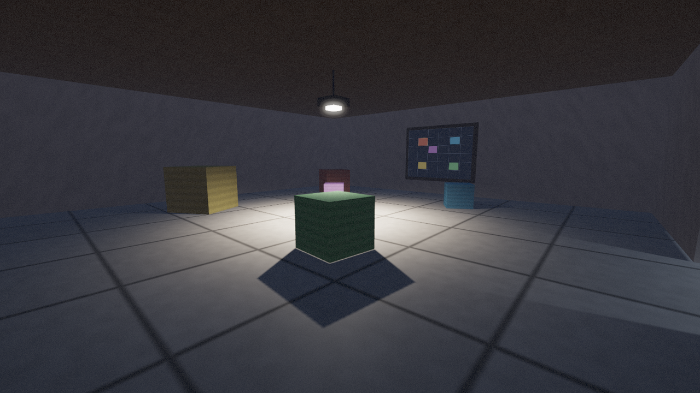
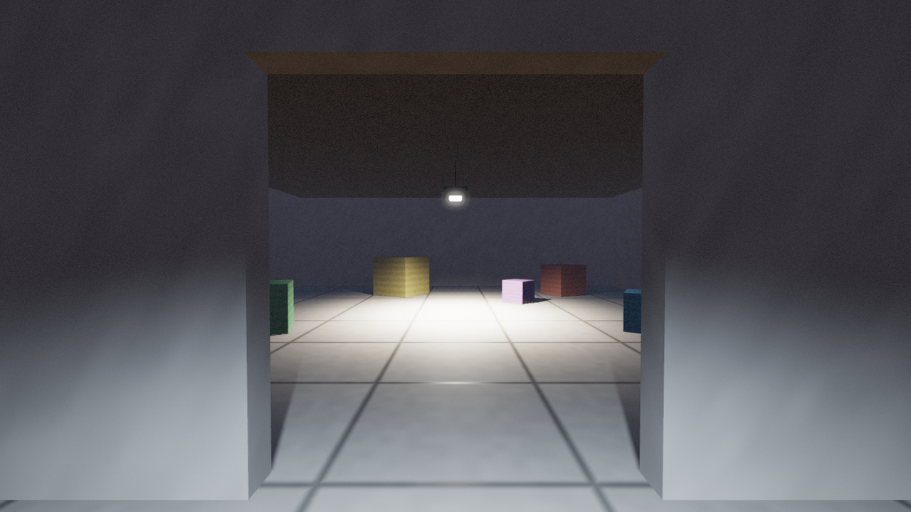

# stategine

A game engine whose only structural idea is the **state**. A state is a small
category: its elements are the objects, its morphisms are the events that act on
them. The engine runs a **state graph** over those states; everything that
crosses between two states crosses through a **functor**, and a state can be
**embedded** inside an element of another, so an interface in one domain edits
the world in a different one.

Nothing in it has a position, a parent, or a privileged frame unless some arrow
says so. Rooms are glued to each other by doorways, and the engine checks that
the gluing actually closes up before it will treat the pieces as one space.

Header-only, C++17. The core has no dependencies; the OpenGL example fetches
GLFW on demand.


## The idea, in four frames

A map hangs on the wall of a 3D room. The map is not a texture of the room - it
is a **2D state embedded in the room's category**, joined to it by a pair of
functors. Walk up to it and press `E`:

| Walk up to it | Open it |
| --- | --- |
|  |  |

Now push the yellow token three cells to the right. The crate it stands for
slides across the floor of the real room, in the same frame, while you are still
looking at the map:

| Before | After |
| --- | --- |
|  |  |

Nothing in the renderer knows about this. It is `stamp`, one of the two
functors, running once a frame because the portal was declared `Live`:

```cpp
graph.add_lens("collapse", "stamp", "room", "wallmap", objects,
               /* room -> map */ swizzle_scaled({{x, x}, {y, z}}, world_to_cell),
               /* map -> room */ swizzle_scaled({{x, x}, {z, y}}, cell_to_world));

graph.embed("wall_map", "room", "wall_map", "wallmap", "collapse", "stamp",
            sg::EmbedSync::Live);
```

The lamp is an ordinary element too, so dimming it (`F`) is a parameter change,
not a renderer feature:



## The second room, and the map that moves the doorway

Neither room has a position. Each is a state with its own coordinates, and the
only thing relating them is a **doorway**: a portal element in each, understood
to be the same doorway seen from either side. Where a room "is" is always an
answer to *seen from where?* - the renderer roots the atlas at whichever room
the viewer is standing in and composes the doorway to place the other.

| Looking through the doorway | Inside the second room |
| --- | --- |
|  |  |

The second map has **one** token, and that token is the doorway itself. Moving
it walks the doorway around the hall's perimeter - and since the annex is
related to the hall only through that doorway, the annex meets a different edge
of the hall each time. From inside the annex nothing moves at all; it is the
hall that swings round. Stand in the hall instead and the identical edit reads
as the annex moving. Neither reading is privileged, and the engine stores
neither:

| doorway on the east wall | on the south wall | on the north wall |
| --- | --- | --- |
|  |  |  |

Structurally the two maps are the same object. Both are a `Surface2D` embedded
`Live` through a lens onto elements of a room:

```cpp
// crate map: tokens <-> crates, mounted in the hall, acting on the hall
graph.add_lens("crates_to_map", "map_to_crates", "hall", "cratemap", crate_objects, ...);
graph.embed("crate_map", "hall", "crate_map", "cratemap",
            "crates_to_map", "map_to_crates", sg::EmbedSync::Live);

// door map: token <-> the doorway, mounted in the annex, acting on the hall
graph.add_lens("door_to_map", "map_to_door", "hall", "doormap", {{"door", "door_tok"}}, ...);
graph.embed("door_map", "annex", "door_map", "doormap",
            "door_to_map", "map_to_door", sg::EmbedSync::Live, /*subject=*/"hall");
```

The only difference is the `subject`: where an interface is *mounted* and what
it *acts on* are separate questions, and the engine makes you answer both
rather than assuming they coincide.

## Gluing: why the pieces are allowed to be one space

An atlas of rooms is one instance of a much older operation - local data,
defined in pieces, glued into one global thing. `sg/core/Sheaf.hpp` holds the
general version and knows nothing about rooms:

* a **`Cover`** is a set of states with declared overlaps, each overlap
  carrying its transition as a pair of functors;
* **descent** is the condition that lets them glue: on every overlap, across
  and back is the identity (*separatedness*), and around every loop the
  composite is the identity (*the cocycle condition*). A loop that does not
  close has holonomy - walk the ring of rooms and you arrive somewhere else -
  and there is no global object to glue to, only a seam;
* **`sections(root)`** is the glued result: the composite transition from the
  root to every piece it can reach.

Both conditions say *this composite is the identity*, and measuring the gap
between a composite and the identity is what `Adjunction` already did - its
unit and counit defects are exactly the descent failures, reported per object
and per parameter. The sheaf module adds no new notion of correctness; it
applies the engine's existing one to the arrows of a cover.

```cpp
for (const auto& seam : sg::descent_defects(atlas, graph))
    std::cout << "seam: " << seam << "
";
```

Two things follow, and they are the practical point of the whole exercise:

1. **You cannot build a space that does not close up without being told.** A
   ring of rooms whose transforms do not compose to the identity is named as a
   seam before anything is drawn.
2. **Inconsistent gluings are mostly unrepresentable rather than merely
   detectable.** A doorway's transition is *derived* from the two portal
   elements every time it is asked for, not stored alongside them, so it cannot
   drift out of step with the geometry it describes. The same arrow that places
   the rooms is the one you travel along when you walk through.

Every image above is reproducible: `./build/sg_room3d 50 out.ppm <room|approach|open|before|after|dim|doorway|annex|east|south|north>`.

## Layout

```
include/sg/
  core/        the engine, domain-agnostic
    Core.hpp        Key (interned names), Value, Params, Element, Event, Morphism, EventBus
    State.hpp       a state: elements + morphisms + lifecycle + indexed dispatch
    Functor.hpp     functors, reusable transports, composition, natural transformations
    Adjunction.hpp  adjoint / isomorphic state pairs, with defect reports
    Embedding.hpp   a state nested in an element of another state
    Sheaf.hpp       covers, descent, gluing - the general form of an atlas
    StateGraph.hpp  states, transitions, functors, lenses, embeddings, validation, DOT
    Engine.hpp      the state stack, the frame, the open portals
  domains/     what a state is *about* - data and arrows, never pixels
    Spatial.hpp     SpatialState / Spatial2D / Spatial3D: bodies, walls, lights,
                    anchored groups, portals, camera queries
    Atlas.hpp       rooms glued by doorways - the spatial instance of a Cover
    Console.hpp     a scrollback and an input line
    Surface.hpp     a 2D state that can hand over its own RGBA raster
  render/      how a state is *shown* - swappable, never owned by the state
    Ascii.hpp       terminal views for 2D, 3D (top-down) and console states
    GLWorld.hpp     the OpenGL view: shadows, HDR, bloom
  gl/          the GL backend: loader, math, resources, shaders, window
  sg.hpp       umbrella for core + domains (renderers are opt-in)
```

The three layers are the reuse story. A domain state knows nothing about
rendering, so the same `Spatial3D` can be a lit room on screen, a top-down
sketch in a terminal and a texture on a wall at the same time. A renderer knows
nothing about a specific game, so it draws any state that speaks the shared
parameter vocabulary (`x/y/z`, `sx/sy/sz`, `r/g/b`, `w/h/yaw`, interned once in
`sg::keys`). And the core knows nothing about either.

## The model

| Concept | In the engine | Category theory |
| --- | --- | --- |
| Element | `Element` in a state | object of that state's category |
| Event morphism | `state.arrow(name, from, to, trigger, fn)` | arrow between objects |
| Composite | `state.compose("gf", "f", "g", trigger)` | `g . f`, typed: `cod(f) == dom(g)` |
| State | a `State` subclass | a small category |
| Transition | `graph.connect(from, trigger, to)` | arrow in the state graph |
| Data transport | `Functor` on a transition or a portal | functor `A -> B` |
| View + edit pair | `graph.add_lens(...)` | a functor pair, `out . in` |
| Lossless pair | `Adjunction` | `F -| G`; both units trivial = isomorphism |
| Nested interface | `graph.embed(...)` | a state living in an object of another |
| Anchored group | `parent` on an element | a frame: poses compose along the chain |
| Cover | `Cover` / `Atlas` | pieces plus the transitions between them |
| Descent | `descent_defects(...)` | separatedness and the cocycle condition |
| Gluing | `Cover::sections(root)` | the composite into one chosen chart |

Ill-typed composition throws. `graph.validate()` reports dangling morphisms,
unknown transition endpoints, unreachable states, functors whose image arrows do
not line up, and portals wired to the wrong state.

## A state

```cpp
class Battle : public sg::State {
public:
    Battle() : sg::State("battle") {
        add_element("hero", "unit").params.set("hp", int64_t{20});
        add_element("slime", "unit").params.set("hp", int64_t{8});

        arrow("strike", "hero", "slime", "attack",          // hero --attack--> slime
              [](sg::State& s, sg::Element& a, sg::Element* b, const sg::Event& ev) {
                  b->params.set("hp", b->params.get_or<int64_t>("hp", 0) -
                                          ev.args.get_or<int64_t>("dmg", 1));
                  if (b->params.get_or<int64_t>("hp", 0) <= 0) s.emit("victory");
              });
    }
};
```

## A graph

```cpp
sg::StateGraph graph;
graph.add<Battle>();
graph.add<sg::ConsoleState>("menu");
graph.connect("battle", "victory", "menu");   // switch
graph.push("battle", "pause", "menu");        // stack on top
graph.pop("menu", "back");                    // and back off
graph.set_initial("battle");

sg::Engine engine(graph);
engine.start();
engine.fire("attack");
engine.run(60.0);
```

Transitions take an optional `guard`, an `action` (which fills the `Params`
handed to `on_enter`), and a `functor`. `"*"` as the source matches any state.

## Functors between domains

Transports are the reusable part: they talk about parameter names, not about 2D
or 3D, so "the map's y axis is the world's z axis" is one call.

```cpp
sg::Functor& lift = graph.add_functor("lift", "world2d", "world3d");
lift.on_object("player", "player", sg::transport::copy_all)
    .on_morphism("move.player", "move.player")
    .on_event(flat.step_event(), deep.step_event());

graph.connect("world2d", "toggle", "world3d").functor = "lift";
```

Built-in transports: `copy_all`, `only({...})`, `swizzle({{dst, src}, ...})`,
`swizzle_scaled(pairs, fn)` for unit changes, and `then(a, b)`.

Composition is `g * f` ("g after f"), checked at the seam;
`graph.compose_functors("roundtrip", {"lift", "flatten"})` registers the
composite. `Functor::check_laws(src, dst)` verifies that every mapped arrow
`f : x -> y` has `F(f) : F(x) -> F(y)`.

`Adjunction` reports what a round trip loses:

```cpp
sg::Adjunction adj("lift -| flatten", &lift, &flatten);
adj.unit_defects(flat);    // objects where G(F(x)) != x
adj.counit_defects(deep);  // objects where F(G(y)) != y
adj.data_defects(flat, scratch3d, scratch2d);   // parameters changed by a round trip
adj.is_isomorphism(flat, deep);
```

In the demo the 2D state parks a `z` it never draws, which is what turns the
free/forgetful pair into an isomorphism - the report prints `isomorphic: yes`.
Drop that slot and the same report names the parameter that died.

## Embedding: a state inside a state

A transition replaces the active state. An embedding nests one: the host keeps
running while a guest lives inside one of its elements (the portal).

```cpp
// declare the view and the edit direction together
graph.add_lens("collapse", "stamp", "room", "wallmap", objects,
               sg::transport::swizzle_scaled({{sg::keys::x, sg::keys::x},
                                              {sg::keys::y, sg::keys::z}}, world_to_cell),
               sg::transport::swizzle_scaled({{sg::keys::x, sg::keys::x},
                                              {sg::keys::z, sg::keys::y}}, cell_to_world));

graph.embed("wall_map", "room", "wall_map", "wallmap", "collapse", "stamp",
            sg::EmbedSync::Live);
```

* `EmbedSync::Live` - `out` runs every frame: move a token on the map and the
  crate in the room moves with it, in the same frame.
* `EmbedSync::Commit` - `out` runs on close, so `close_embed(name, false)` is
  a cancel button.
* `EmbedSync::View` - `in` runs every frame and nothing comes back: a read-only
  window onto another state.

An embedding also carries a `subject`: the state the guest is a view *of*.
It defaults to the host - a map on the wall of the room it describes - but a
panel can hang in one room and act on another, and saying so keeps "where it is
displayed" from being quietly conflated with "what it edits".

Open and close with `engine.open_embed(name)` / `engine.close_embed(name)`, or
by firing `embed.open` / `embed.close` with a `name` argument. While a portal
holds focus, engine events go to the guest; `engine.focused()` says which state
that is. Portals nest: a guest may host a portal of its own.

## The OpenGL view

`sg::render::GLWorldView` draws any `Spatial3D`. Per frame:

1. one pass per portal bound to another 3D state (`bind_world`), rendered from
   that state's own camera - a doorway between two *states*, should you want one
2. a depth-only shadow pass per shadow-casting lamp: the two nearest the
   viewer get a 2048² map each, so a second room stays shadowed while you are
   standing in it
3. scene into a multisampled RGBA16F target: up to four spot lights, 4x4 PCF
   shadows from the nearest two, hemispheric ambient, a GGX-ish specular lobe,
   procedural floor tiles / wall plaster / crate planks, distance fog
4. resolve, bright pass, separable gaussian blur at half resolution
5. ACES tonemap with bloom, vignette, grain and a light FXAA



Level geometry is data: a state with `wall` elements has them drawn (and gets
only a floor and a ceiling from its `room_*` parameters), while a state without
any gets the implicit four-wall box. Anchored elements are placed through
`world_pose`, so a moving group needs nothing from the renderer.

Quality knobs live in `sg::render::GLQuality` (shadow size, MSAA, bloom
strength/threshold/passes, exposure). Elements decide their own look through
parameters: `r/g/b`, `roughness`, `sx/sy/sz`, `yaw`, and for the lamp
`intensity`, `inner`, `outer`, `dx/dy/dz`.

## Performance

Names are interned to `Key`s at setup, so the hot paths compare pointers.
Element lookup is a hash on that pointer, morphisms are bucketed by trigger (an
event only visits the arrows that listen for it), `Params` is a flat vector
scanned linearly, and the event queues reuse their buffers frame to frame. A
`Surface2D` only re-rasterises when something on it actually moved, and the GL
view only re-uploads a portal texture when the raster's revision changed.

`./build/sg_bench` on this machine (512 bodies, 513 arrows, -O2):

```
element lookup                     103,000 k/s
frames (512 integrator arrows)          47 k/s      ~24M arrow applications/s
functor apply (512 objects)         21,000 k/s
frames with a live portal               11 k/s      (transport runs twice a frame)
```

## Examples

| Target | What it shows |
| --- | --- |
| `sg_demo` | console/2D/3D states, an isomorphic 2D-3D pair, transitions, a portal, DOT output - headless |
| `sg_room` | the same room and lens as the 3D example, drawn in the terminal |
| `sg_room3d` | **the real one**: one lit OpenGL space, two rooms, and two maps - one that moves the crates, one that moves the second room |
| `sg_tests` | 103 assertions over keys, morphisms, composition, guards, functors, adjunctions, portals |
| `sg_bench` | throughput of the hot paths |

### Build

```sh
cmake -S . -B build -G "MinGW Makefiles"   # or your generator of choice
cmake --build build -j
./build/sg_tests
./build/sg_room3d
```

GLFW is fetched by CMake for `sg_room3d` only; `-DSG_BUILD_GL=OFF` skips it and
the download.

### sg_room3d controls

```
W A S D   walk            (in map mode: move the selected token)
mouse     look            Esc releases the mouse, Esc again quits
E         use the map     while standing in front of it
Tab       select token    while the map is open
C         cancel          close the map, discarding the edits
Q / R     slide the lamp  F  dim / brighten
doorway   walk through the opening
```

Walk to the wall, press `E`, push a token one cell with `D`: the crate it stands
for slides across the floor behind you while you are still looking at the map.
Nothing special-cases that - it is `stamp` running once a frame because the
portal was declared `Live`. The map in the second room works identically; its
one token happens to be the anchor the whole room hangs from.

`./build/sg_room3d 120 frame.ppm` runs 120 frames, writes the last one to a PPM
and exits, which is how the renderer is smoke-tested without a display.
