# stategine
#### as above; so below
A game engine whose only structural idea is the **state**. A state is a small
category: elements are its objects, events acting on them are its arrows. States
form a **graph**; data crosses between them through **functors**, and a state
can be **embedded** in an element of another, so an interface in one domain
edits the world in another. The engine holds all of it to its laws - at compile
time where it can, on live data where it must.

Header-only C++17, no dependencies. The OpenGL example fetches GLFW on demand.

Building on it, or changing it? [AGENTS.md](AGENTS.md) is the short version of
how: standalone states, joined only through interfaces the graph declares and
the laws check - and the engine watching that they are.

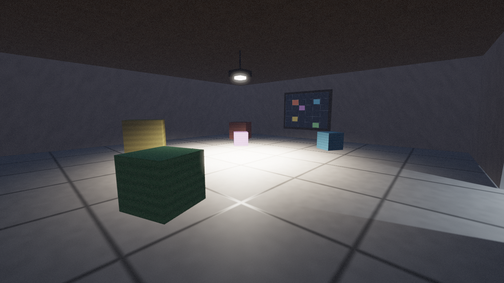

## The idea, in four frames

A map hangs on the wall of a 3D room. It is not a texture: it is a **2D state
embedded in the room**, joined to it by a pair of functors. Open it and push the
yellow token three cells right - the crate it stands for slides across the real
floor, in the same frame:

| Walk up to it | Open it | Before | After |
| --- | --- | --- | --- |
| 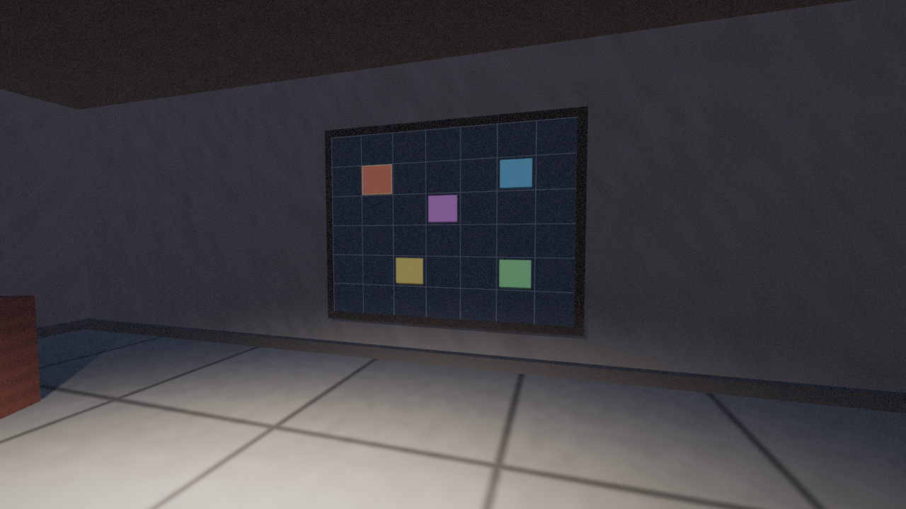 | 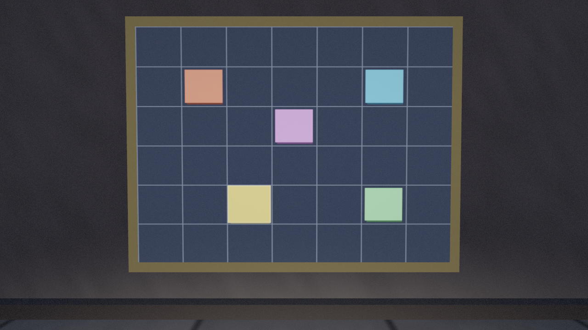 | 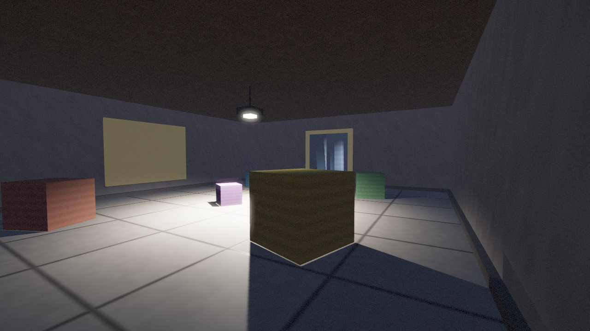 | 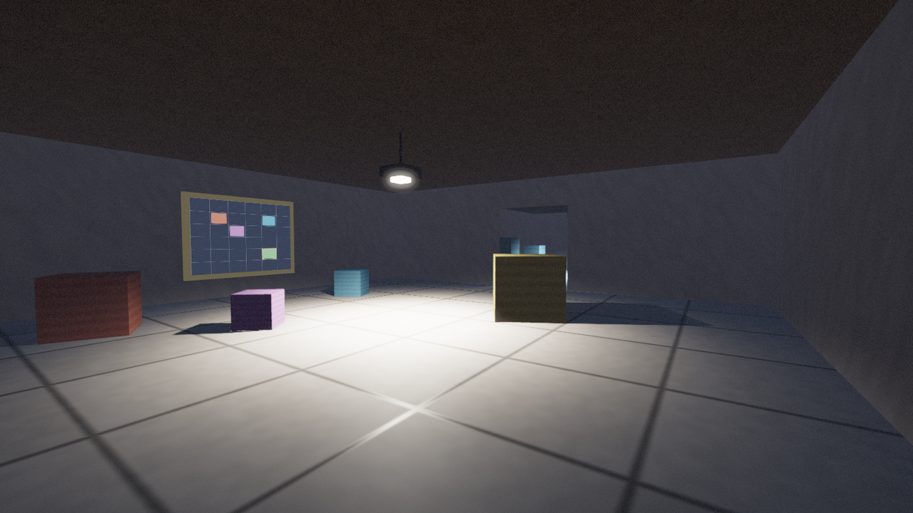 |

The renderer knows nothing about this. It is one functor, `stamp`, running every
frame because the portal is `Live`:

```cpp
graph.add_lens("collapse", "stamp", "room", "wallmap", objects,
               /* room -> map */ swizzle_scaled({{x, x}, {y, z}}, world_to_cell),
               /* map -> room */ swizzle_scaled({{x, x}, {z, y}}, cell_to_world));
graph.embed("wall_map", "room", "wall_map", "wallmap", "collapse", "stamp",
            sg::EmbedSync::Live);
```

## Two rooms, and a map that moves the doorway

Neither room has a position. The only thing relating them is a **doorway**: a
portal element in each, the same doorway seen from either side. The renderer
roots the world at whichever room you stand in and composes the doorway to place
the other.

The second room's map has one token: the doorway itself. Moving it walks the
doorway around the hall - from inside the annex the hall swings round, from the
hall the annex moves. The engine stores neither reading.

| Through the doorway | Inside the annex | Door on the east wall | south | north |
| --- | --- | --- | --- | --- |
| 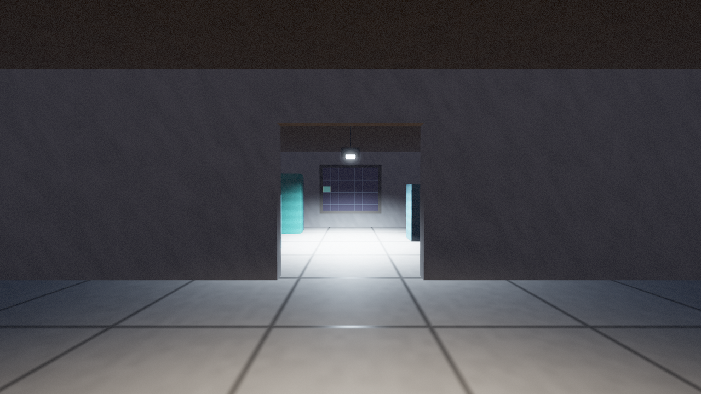 | 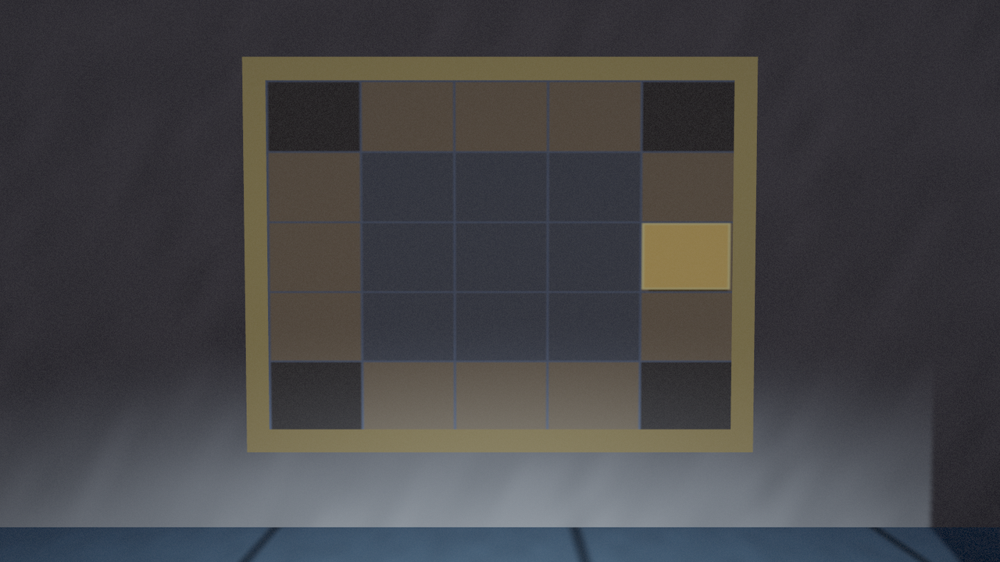 | 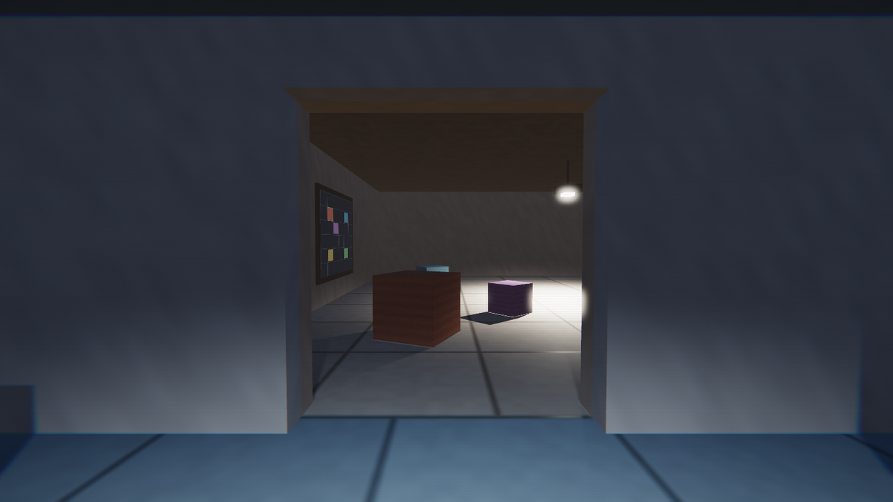 | 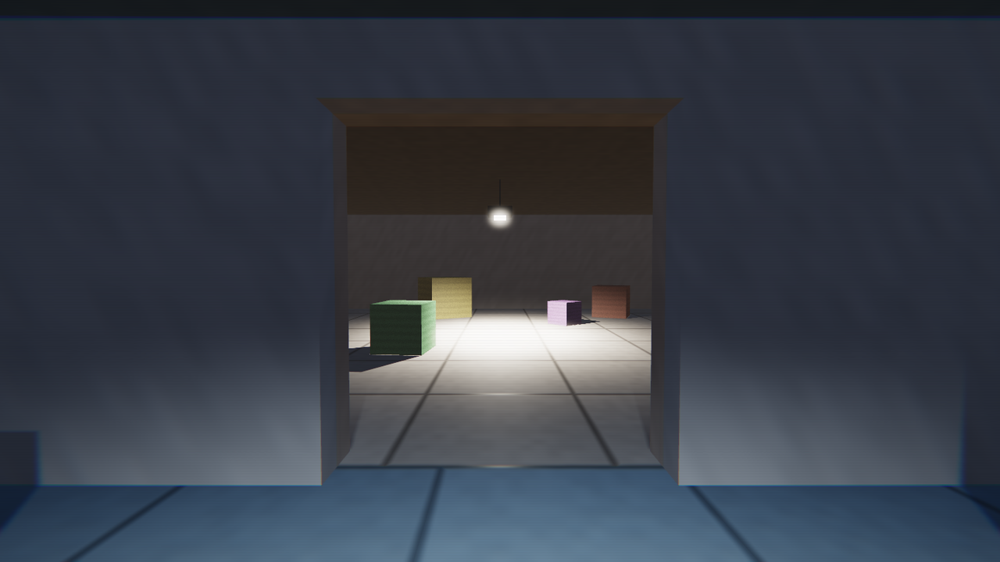 | 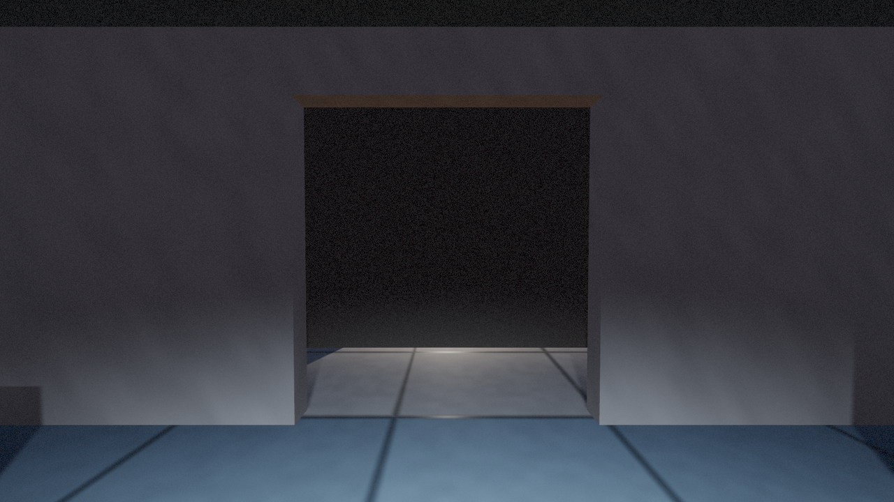 |

The door map is a plan of the hall on purpose: a doorway has twelve stations,
three to a side, and the border of a 5x5 board is a ring of exactly twelve cells.
An interface shaped unlike what it edits offers moves its subject cannot make.

Both maps are the same construction. The difference is the `subject` - where an
interface is *mounted* and what it *acts on* are separate questions:

```cpp
graph.embed("crate_map", "hall", "crate_map", "cratemap",   // mounted in the hall, edits the hall
            "crates_to_map", "map_to_crates", sg::EmbedSync::Live);
graph.embed("door_map", "annex", "door_map", "doormap",     // mounted in the annex, edits the hall
            "door_to_map", "map_to_door", sg::EmbedSync::Live, /*subject=*/"hall");
```

## Gluing

Rooms glued by doorways are one case of local pieces glued into a whole.
`sg/core/Sheaf.hpp` holds the general version and knows nothing about rooms:

* a **`Cover`** is a set of states with declared overlaps, each carrying its
  transition as a pair of functors;
* **descent** lets them glue: across an overlap and back is the identity
  (*separatedness*), and around every loop the composite is the identity
  (*cocycle*). A loop that does not close is a seam;
* **`sections(root)`** is the glued result, every piece in one chosen chart.

```cpp
for (const auto& seam : sg::descent_defects(atlas, graph)) std::cout << "seam: " << seam << "\n";
```

A doorway's transition is *derived* from its two portal elements each time it is
asked for, so it cannot drift from the geometry it describes.

Glued rooms are **adjacent, never overlapping**. A doorway's plane is where one
room ends and the next begins: each room's solids stay on its own side, and the
renderer draws each room only on its own side. A wall centred on the plane
would put half of itself in the neighbour, and each room's look would bleed
into the other's wall. `descent_defects` names it:

```
seam: hall.e_a reaches 0.150000 m past doorway doorway, into the room on the other side
```

Every image here is reproducible:
`./build/sg_room3d 50 out.ppm <room|approach|open|before|after|dim|doorway|annex|east|south|north|alert|crossing>`.
Shots advance fades by a fixed 1/60 s per frame, so a mid-fade frame is the same
on every run (`crossing` steps through the doorway at frame 30).

## The laws

An invalid structure is refused at the earliest point that can see it:

1. **Compile time** (`sg/core/Typed.hpp`). State and element names become C++
   tags, so composing arrows or functors whose ends do not meet, a lens whose
   halves do not mirror, or claiming non-parallel arrows equal does not build:
   ```
   error: static assertion failed: sg: g * f needs cod(f) == dom(g); these arrows do not meet
   ```
2. **Structure** (`graph.validate()`). Dangling arrows, unknown endpoints,
   unreachable states, functors whose image arrows do not line up, portals wired
   to the wrong state.
3. **Live data** (`sg/core/Laws.hpp`). `sg::verify(graph)` runs every law on the
   states' current contents, then puts everything back. A broken law is a
   counterexample:
   ```
   functoriality @ functor post on restock: ledger.book.stock was <unset>;
       shop.shelf [restock ; post] leaves 42, shop.shelf [post ; order_wrong] leaves 40
   ```

Every data law says *these two paths, run on the same data, leave the same
result*:

| Law | The two paths |
| --- | --- |
| Identity | `id ; f` and `f ; id` against `f`, for arrows and functors |
| Associativity | `(f ; g) ; h` against `f ; (g ; h)` |
| Composition | a registered composite against the chain it was built from |
| Functoriality | `f` then `F` against `F` then `F(f)` - the functor carries the arrow's *action* |
| Put-get | write a view back, read it again: you see what you wrote |
| Put-put | writing the same view twice is writing it once |
| Settles | `(get ; put)` twice against once - a lossy view must still settle |
| Commutes | any two paths you declare equal |
| Descent | separatedness and cocycle on a `Cover` (`descent_defects`) |

```cpp
sg::Diagram d("shelf work");
d.commutes(sg::Path("shop", "shelf").arrow("restock").arrow("halve"),
           sg::Path("shop", "shelf").arrow("halve").arrow("restock"));
sg::verify(graph, {d});   // shop.shelf.stock was 30; [restock ; halve] leaves 21, [halve ; restock] leaves 27

// typed, the same claim cannot be written with arrows that do not share both ends
sg::typed::commutes(d, refund * sell, sg::typed::id<Shelf>());   // Shelf -> Shelf, both sides
sg::typed::commutes(d, sell, refund);                            // does not compile
```

`sg::enforce(graph)` throws a `LawError` instead of reporting. Arrows that read
event arguments are probed through `LawOptions` - an integrator that does nothing
at `dt = 0` passes every law vacuously, so give it a `dt`. Only elements, state
parameters and queued events are undone after a check; side effects a handler
has elsewhere are not.

Turning the laws on found three core bugs every earlier check had passed: the
identity functor dropped objects created after it was built, a composite ending
in a loop was registered with the wrong type, and a rebuilt part could leave its
composite behind unnoticed. It also found the demo's 2D/3D "isomorphism" held
only on scratch data.

## Using stategine in a project

Pin a release; none of the engine's examples, tests or downloads come along.

```cmake
include(FetchContent)
FetchContent_Declare(stategine
  GIT_REPOSITORY https://github.com/Bardia323/stategine.git
  GIT_TAG        v0.2.0)
FetchContent_MakeAvailable(stategine)

target_link_libraries(my_game PRIVATE stategine::stategine
                      stategine::warnings          # optional: -Wall -Wextra / /W4
                      stategine::static_runtime)   # optional: self-contained MinGW exes
```

To change the engine and a project together, build against a local checkout,
uncommitted edits included: `-DFETCHCONTENT_SOURCE_DIR_STATEGINE=../stategine`.
[stategine-template](https://github.com/Bardia323/stategine-template) (private)
sets this up, with a ctest that runs every law on the game's world. What each
release breaks is in `CHANGELOG.md`.

## Writing a game

| Concept | In the engine | Category theory |
| --- | --- | --- |
| Element | `Element` in a state | object |
| Event morphism | `state.arrow(name, from, to, trigger, fn)` | arrow |
| Composite | `state.compose("gf", "f", "g", trigger)` | `g . f`, needs `cod(f) == dom(g)` |
| State | a `State` subclass | a small category |
| Transition | `graph.connect(from, trigger, to)` | arrow in the state graph |
| Data transport | `Functor` on a transition or portal | functor `A -> B` |
| View + edit pair | `graph.add_lens(...)` | a functor pair |
| Adjoint pair | `Adjunction` | `F -| G` by unit, counit and triangle laws; isomorphism when both are identities |
| Nested interface | `graph.embed(...)` | a state inside an object of another |
| Cover, gluing | `Cover`, `Atlas`, `sections(root)` | descent |

### A state

```cpp
class Battle : public sg::State {
public:
    Battle() : sg::State("battle") {
        add_element("hero", "unit").params.set("hp", int64_t{20});
        add_element("slime", "unit").params.set("hp", int64_t{8});

        arrow("strike", "hero", "slime", "attack",          // hero --attack--> slime
              [](sg::State& s, sg::Element&, sg::Element* slime, const sg::Event& ev) {
                  const int64_t hp = slime->params.get_or<int64_t>("hp", 0) -
                                     ev.args.get_or<int64_t>("dmg", 1);
                  slime->params.set("hp", hp);
                  if (hp <= 0) s.emit("victory");   // an event of the battle, not yet of the game
              });
    }
};
```

### A graph

```cpp
sg::StateGraph graph;
auto& battle = graph.add<Battle>();
graph.add<sg::ConsoleState>("menu");
graph.connect("battle", "victory", "menu");   // switch
graph.push("battle", "pause", "menu");        // stack on top
graph.pop("menu", "back");                    // and back off
graph.set_initial("battle");

sg::Engine engine(graph);
// A state's events stay in the state. Forward the ones that should move the
// game - here, rather than from inside the arrow, so the law checks can run
// the arrow without setting the engine in motion.
battle.bus().subscribe("victory", [&engine](const sg::Event& e) { engine.fire(e); });
engine.start();
engine.fire(sg::Event{"attack", sg::Params{}.set("dmg", int64_t{8})});
engine.run(60.0);
```

Transitions take an optional `guard`, an `action` (fills the `Params` handed to
`on_enter`) and a `functor`. `"*"` as the source matches any state.

### Functors

Transports talk about parameter names, not 2D or 3D, so "the map's y is the
world's z" is one call. Built in: `copy_all`, `only({...})`,
`swizzle({{dst, src}, ...})`, `swizzle_scaled(pairs, fn)`, `then(a, b)`.

```cpp
sg::Functor& lift = graph.add_functor("lift", "world2d", "world3d");
lift.on_object("player", "player", sg::transport::copy_all)
    .on_morphism("move.player", "move.player")
    .on_event(flat.step_event(), deep.step_event());
graph.connect("world2d", "toggle", "world3d").functor = "lift";
graph.compose_functors("roundtrip", {"lift", "flatten"});   // g * f, checked at the seam
```

`Adjunction` is `F -| G` witnessed properly: declare a unit arrow
`a -> G(F(a))` and a counit arrow `F(G(b)) -> b` per object (`unit`,
`counit`, with `identity` marking no-op loops that stand for identities), and
`check` verifies both naturality squares and both triangle identities, on the
arrows. `laws::adjunction(graph, adj)` runs the same equations on live data.
The round trip need not come home - the order `0 < 1` collapsed onto a point
is adjoint to picking out `1`, with unit `0 -> 1` - so an adjunction is not an
isomorphism. What a round trip loses is still reported (`unit_defects`,
`counit_defects`, `data_defects`, `is_isomorphism`): those measure whether the
pair is an isomorphism, not whether it is adjoint.

### Embeddings

A transition replaces the active state; an embedding nests one inside an element
(the portal) of a running host.

* `EmbedSync::Live` - `out` runs every frame: the map moves the crate at once.
* `EmbedSync::Commit` - `out` runs on close; `close_embed(name, false)` cancels.
* `EmbedSync::View` - `in` runs every frame, nothing comes back.

"Every frame" is as the embedding's `Propagation` says (`graph.set_propagation`):

* `OnChange` (the default) - only the objects whose source or target changed
  since the direction last ran, found by their stamps; with nothing changed it
  costs a comparison. The same result as running every frame, for a transport
  that is a function of the two elements' params.
* `Continuous` - every object, every frame: for a transport that reads anything
  else (the time, another element).
* `OnEvent` - only in a frame in which an event crossed into the guest through it.
* `Manual` - only when `engine.sync_embed(name)` says so.

An embedding is declared, then read: `embed` hands back a const view, and what
it joins changes only through the graph (`set_sync`, `set_propagation`,
`drop_embedding`), each counted. `set_focus(name, on)` says whether it takes
input when opened. The subject need not be the host - a panel hanging in one
room can act on another.

Open and close with `engine.open_embed(name)` / `close_embed(name)`, or fire
`embed.open` / `embed.close` with a `name`. A focused portal receives the
engine's events; portals nest.

## Rendering

Domain states never know about pixels, and renderers never know about a game:
anything speaking the shared vocabulary (`x/y/z`, `sx/sy/sz`, `r/g/b`,
`w/h/yaw`, in `sg::keys`) can be drawn. So one `Spatial3D` can be a lit room, a
terminal sketch and a texture on a wall at once.

`sg::render::GLWorldView` draws any `Spatial3D`: portal passes into other
states, shadow maps for the two nearest lamps, up to four spot lights with PCF
shadows, procedural materials and fog, then bloom, ACES tonemapping and FXAA.
Walls are data - a state with `wall` elements gets them drawn, one without gets a
box. Knobs are in `sg::render::GLQuality`; elements set their own look through
parameters (`r/g/b`, `roughness`, `intensity`, ...).


### Looks

How a room is shown is a state too. A `LookState` has one element per pass
(`shadow`, `scene`, `bright`, `blur`, `composite`); a parameter starting with `u`
is a uniform of that pass, and `fs`/`vs` replace its shaders. A look only states
how it differs from the standard one. Rooms *wear* looks through an embedding,
so looks are ordinary, reachable, validated states:

```cpp
auto& alert = graph.add<sg::LookState>("hall.alert");
alert.uniform(sg::passes::composite, "uTint", 1.3, 0.62, 0.55)
     .uniform(sg::passes::scene, "uFogDensity", 0.035)
     .fade(0.35);                                  // seconds to fade in
cool.shader(sg::passes::composite, my_composite);  // a pass with its own shader

sg::wear(graph, "hall", "hall.calm");              // the first worn is active
sg::wear(graph, "hall", "hall.alert");
sg::set_look(hall, "hall.alert");                  // a parameter write; the renderer fades
```

Each room is drawn in its own look, so the annex keeps its fog when seen from
the hall. The post passes follow the room the viewer stands in.

What is on screen is a *blend* of looks, as weights. A change of look moves
weight towards the look now wanted, at the rate its `fade` sets, and never
jumps. If the change is undone half way, the blend walks back along the same
path to where it started. A third look reached mid-fade starts from the blend
on screen, not from either end. Numbers are weighted averages. The composite
pass runs every program in the blend and averages them, so a change of shader
dissolves too. The other passes use the shader of the heaviest look.

`view.prepare(graph)` compiles every look reachable in the graph before the
first frame. Looks that only change numbers share the built-in programs. It
also reports, as counterexamples, shaders that do not build (the built-in is
used instead), shaders missing a uniform the renderer sets, and looks that set
a uniform their shader does not have. `view.stats().late` counts anything
compiled mid-game because `prepare` never saw it.

| Calm | Alert (`L`) |
| --- | --- |
|  | 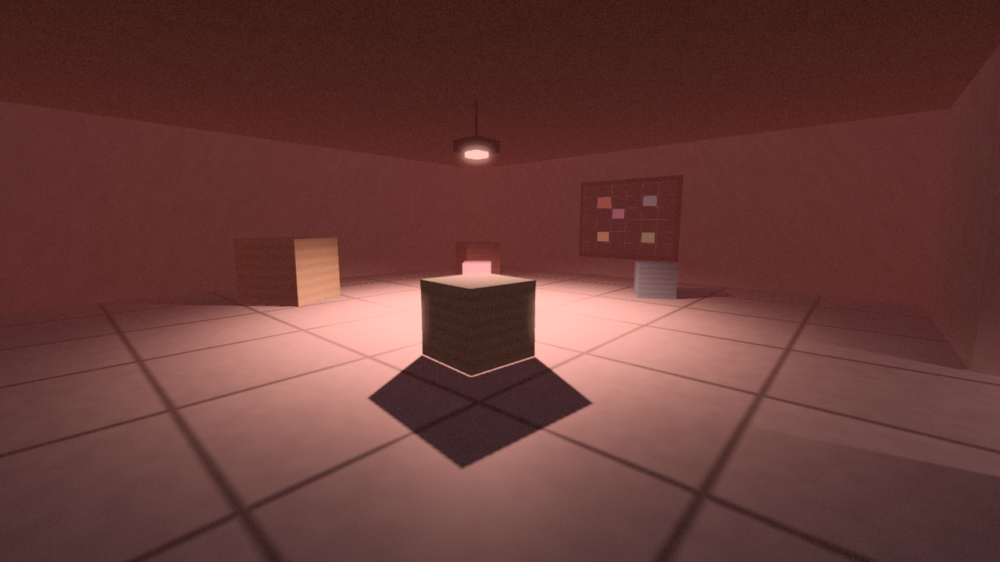 |

## Performance

Names are interned once, so hot paths compare pointers; morphisms are bucketed
by trigger; `Params` is a flat vector; queues reuse their buffers; surfaces and
portal textures redraw only when something moved. `./build/sg_bench` here
(512 bodies, -O2):

```
element lookup                      96,000 k/s
frames (512 integrator arrows)          40 k/s      ~20M arrow applications/s
functor apply (512 objects)         21,000 k/s
frames with a live portal               16 k/s      (9 k/s carrying everything every frame)
```

**Pay when the structure changes, not while it stands.** Everything the engine
works out and keeps is derived from the one graph, holds nothing of its own,
and is thrown away and found again when what it was found on changes:

* *Stamps.* Every change of an element's params gets the next number of one
  count (`Params::stamp()`; setting a value it already holds is no change). A
  stamp names content, so a copy - a snapshot, a restored default - carries it.
  `State::structure()` is stamped when elements or arrows come or go;
  `State::content_version()` folds a state's stamps into one number.
* *Portals.* An embedding's route (states, functors) is resolved once per
  change of the graph's `topology()`; its functor keeps a `Functor::Memo` of
  which element went where and what each held, and carries only what changed.
* *Validation.* `validate()` checks a state's arrows, a functor's endpoints and
  reachability again only when their structure moved; `validate(false)` checks
  everything, to compare.
* *Laws.* A `LawCache` keeps each equation's answer with the versions of what
  its paths read (`verify(graph, cache)`), reuses a side of an equation that is
  unchanged when the other is not, and checks directly an equation that is
  cheaper to run than to keep or never comes out the same twice. Without a
  cache, `verify` is still faster: a side's end state is taken, not copied,
  and sides that left the same stamps agree without a value compared.

`./build/sg_bench_scale` measures all of it at 1K..1M objects against the
plain way (`--quick`, `--big`, or case numbers). Some of what it shows: a Live
portal of 100K objects costs 0.5 ms a frame idle and 1.6 ms with 1% changing,
against 72 ms carrying everything; with every object changing, still less
than half. A graph verified again unchanged costs about 45% of a fresh check.

## Who may change what

Whoever holds the `StateGraph` - the code that builds the world, and whatever
rewrites it as it runs - may change anything in it. Whoever holds it `const`
may look at everything and change nothing: a const graph gives const states,
elements, functors. The engine shows the world const (`current()`,
`focused()`, `graph()`): a caller acts on it by firing events. A state changes
its own data in its update and its arrows (handed the state); functors carry
data into the state they land in; an embedding acts on its declared subject.

What the graph is made of - states, their elements and arrows, functors and
their maps, embeddings, seams, transitions - is counted by `revision()` (the
interfaces alone by `topology()`), one add per change and nothing else;
changing a value never counts. Embeddings, transitions, seams and arrows are
declared and then read: nothing rewrites one in place behind the graph's back
(`set_sync`, `set_propagation`, `set_carry`, `drop_embedding`, `set_functor`
do it, counted). The engine checks the graph again at its next frame after the
count moved; unchanged, it is not checked.

An element's identity is fixed when it is made: `id` and `kind` read like any
`Key`, and nothing but the element sets them. A mutable state hands out its
elements (`elements()`, an `ElementRange`) to act on, never the list itself.

A law's trial runs arrows on the live graph, then puts their data back. It
does not try to put back structure: while a trial runs, nothing structural is
let happen at all - no functor, embedding or seam, and no element or arrow
added to or taken from any state. A path that would do it throws
`RewriteRefused` before anything changes, and its equation is reported as
unchecked (`LawReport::unchecked`), apart from the counterexamples.

## Layout

```
include/sg/
  core/      the engine, domain-agnostic
    Core.hpp State.hpp Functor.hpp Adjunction.hpp Embedding.hpp
    StateGraph.hpp Engine.hpp Sheaf.hpp (covers, descent)
    Laws.hpp (laws on live data)  Typed.hpp (compile-time typed handles)
  domains/   what a state is about: Spatial, Atlas, Console, Surface, Look
  physics/   solvers a state can step in its arrows, plain data in and out:
    Rigid.hpp (sg::rigid: bodies that fall, stack, tip, roll, sleep, are held)
    Rope.hpp  (sg::rope: cords that hang, lie over edges, never pass through)
  render/    how a state is shown: Ascii, GLWorld
  gl/        the GL backend
  sg.hpp     umbrella for core + domains (renderers are opt-in)
  Version.hpp
```

## Build and run

```sh
cmake -S . -B build -G "MinGW Makefiles"   # or any generator; -DSG_BUILD_GL=OFF skips GLFW
cmake --build build -j
ctest --test-dir build                     # unit tests, laws, must-not-compile cases
./build/sg_room3d
```

| Target | What it is |
| --- | --- |
| `sg_room3d` | **the real one**: one lit OpenGL space, two rooms, two maps |
| `sg_room` | the same room and lens, in the terminal |
| `sg_demo` | console/2D/3D states, an isomorphic pair, transitions, a portal, the laws - headless |
| `sg_tests` | 178 assertions over the core, functors, portals, rooms and looks |
| `sg_laws` | every data law holding, then broken on purpose and read back |
| `sg_looks_gl` | looks on a real GL context: broken shaders named, fallbacks, late compiles counted (needs a display) |
| `compile_fail_*` | pass only if an ill-typed composition is refused with stategine's own message |
| `sg_core_only` | the core with no domain or renderer - the layering, as a build failure |
| `sg_bench` | hot-path throughput |

`sg_room3d` controls: `WASD` walk (moves the token in map mode), mouse look,
`E` use a map, `Tab` next token, `C` cancel, `Q`/`R` slide the lamp, `F` dim,
`L` switch the hall's look, `Esc` release mouse / quit. `./build/sg_room3d 120 frame.ppm` renders 120 frames
to a PPM and exits.
