# stategine

<p align="center">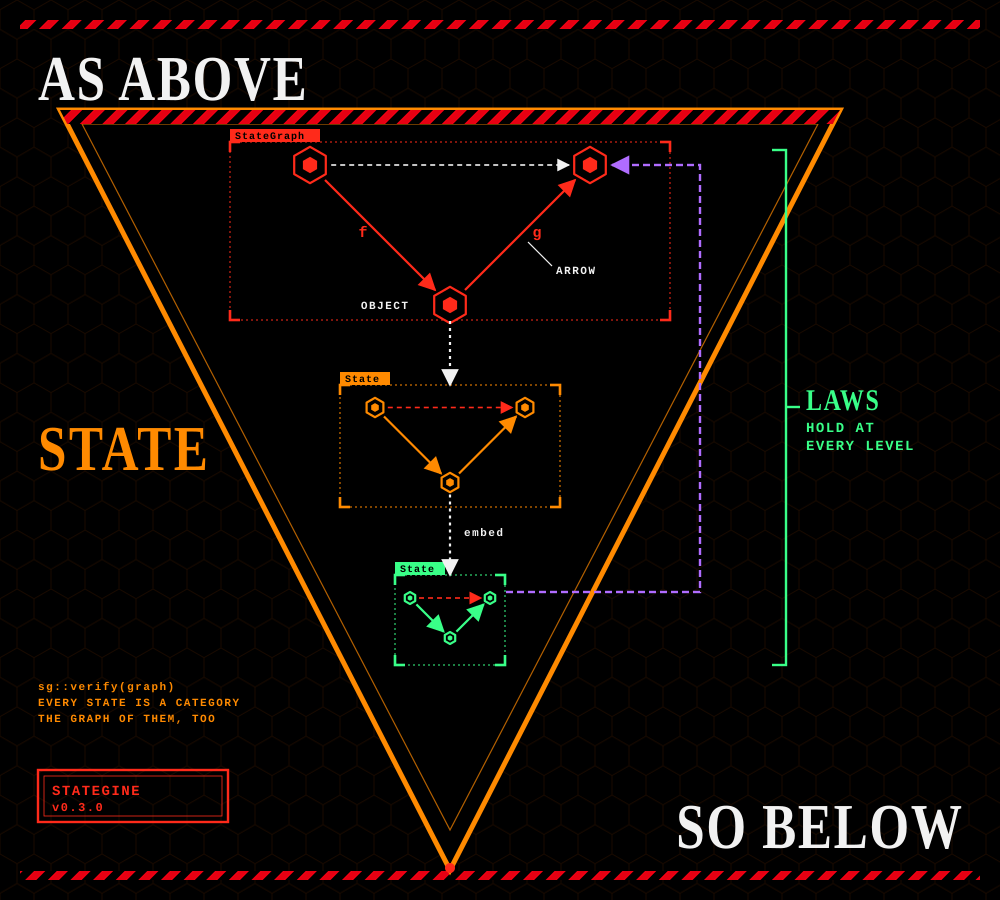</p>

A metaphysics engine. It models what things are, how they are joined, and what
must hold when they are. Its one idea is the **state**: a small category whose
elements are objects and whose events are arrows. States form a **graph**; data
crosses between them through **functors**, and a state can be **embedded** in an
element of another, so an interface in one domain edits the world in another.
The engine holds all of it to its laws - at compile time where it can, on live
data where it must.

Physics and renderers come with it: bodies, ropes, fields, light, GL, WebGPU and ASCII.
Solvers and views are machinery used by states; their data and connections
belong to the owning states and graph. A game, desktop or painting you walk
into is a world of states.

C++17. `stategine::stategine` contains core, domains, spatial, physics and
compiled laws; `stategine::render` adds derived view machinery and ASCII;
`stategine::gl` draws natively and Emscripten's `stategine::web` draws through
WebGPU and adapts DOM input/WebRTC. `stategine::dsl` and native `sgc`
compile the notation. `stategine::gpu` exposes optional algebra backends.
`stategine::net` adds sparse matrix-free CPU/CUDA reconciliation, neighboring execution partitions, signed canonical epochs, independent verification, regional quorum finalization and disposable latency prediction over external byte transport.
The libraries need no window dependency; `sg/gl/Window.hpp` uses your GLFW,
and OpenGL examples fetch it on demand.

Building on it, or changing it? [AGENTS.md](AGENTS.md) is the short version of
how: standalone states, joined only through interfaces the graph declares and
the laws check - and the engine watching that they are.

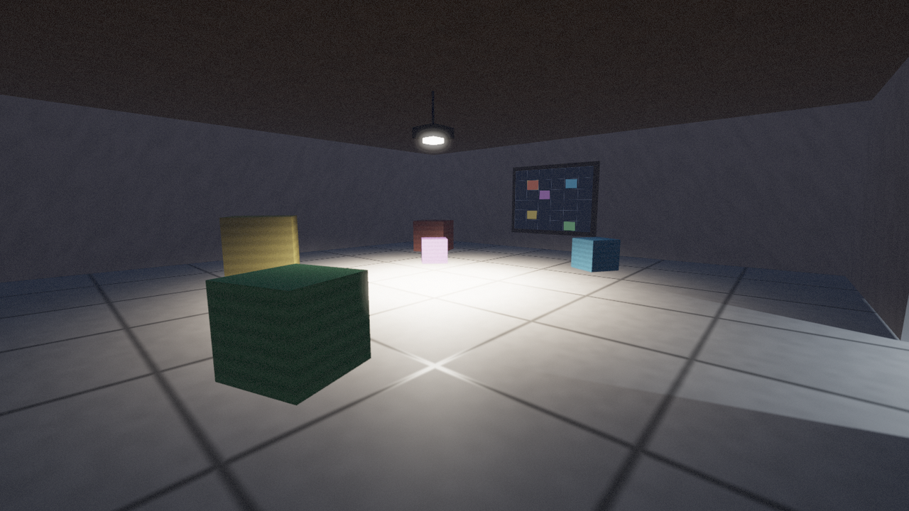

## The idea, in four frames

A map hangs on the wall of a 3D room. It is not a texture: it is a **2D state
embedded in the room**, joined to it by a pair of functors. Open it and push the
yellow token three cells right - the crate it stands for slides across the real
floor, in the same frame:

| Walk up to it | Open it | Before | After |
| --- | --- | --- | --- |
| 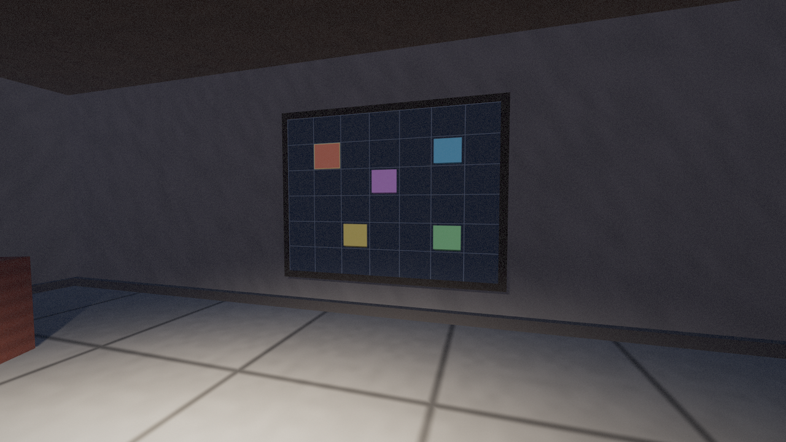 | 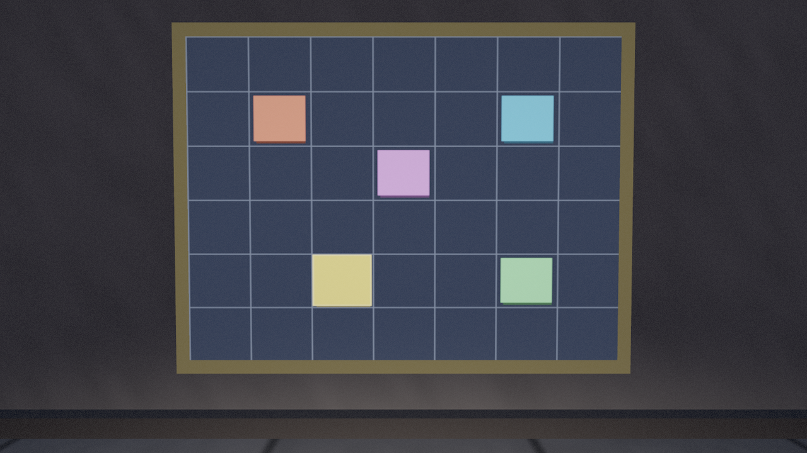 | 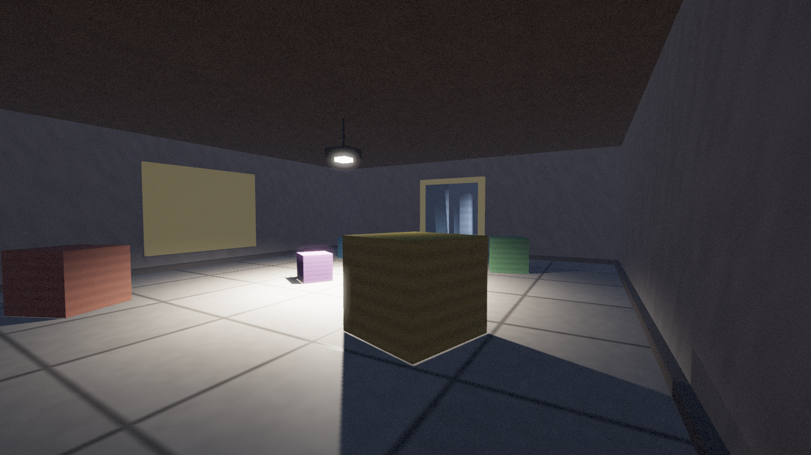 | 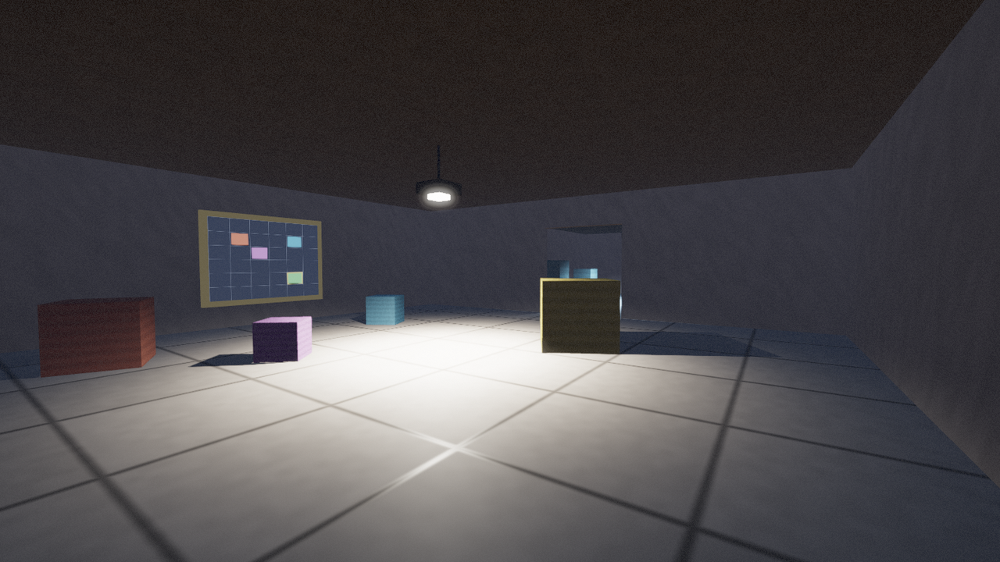 |

The renderer does not move the crate. The `stamp` functor carries the map's
edits because its embedding is `Live`:

```cpp
graph.add_lens("collapse", "stamp", "room", "wallmap", objects,
               /* room -> map */ swizzle_scaled({{x, x}, {y, z}}, world_to_cell),
               /* map -> room */ swizzle_scaled({{x, x}, {z, y}}, cell_to_world));
graph.embed("wall_map", "room", "wall_map", "wallmap", "collapse", "stamp",
            sg::EmbedSync::Live);
```

## Two rooms, and a map that moves the doorway

Rooms have local coordinates, related by a **doorway**: one portal on each
side of the same boundary. The renderer roots the view in the current room
and composes doorway travel to place the other.

The second room's map has one token: the doorway itself. Moving it walks the
doorway around the hall - from inside the annex the hall swings round, from the
hall the annex moves. The engine stores neither reading.

| Through the doorway | Inside the annex | Door on the east wall | south | north |
| --- | --- | --- | --- | --- |
| 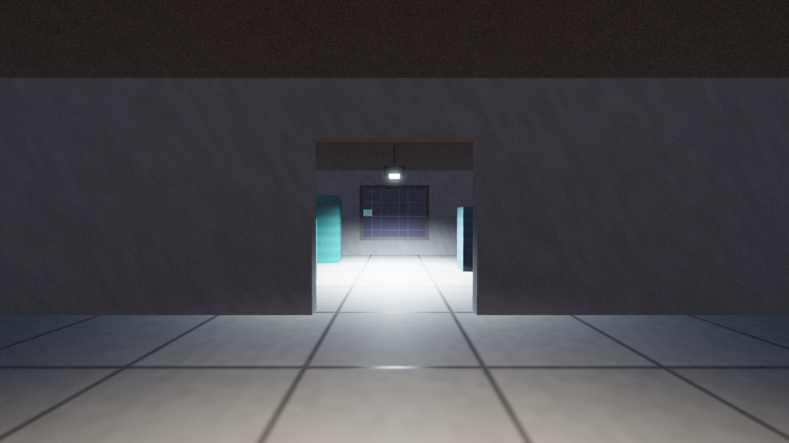 | 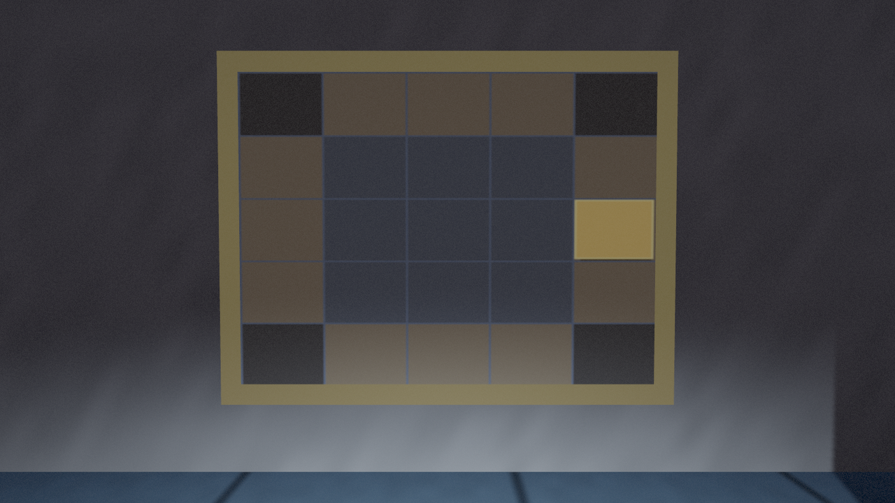 | 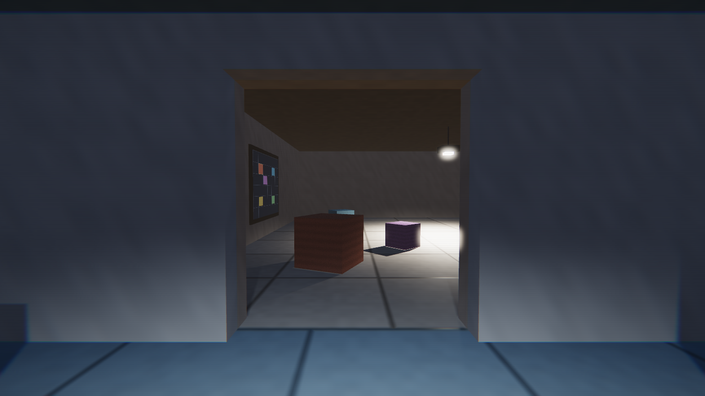 | 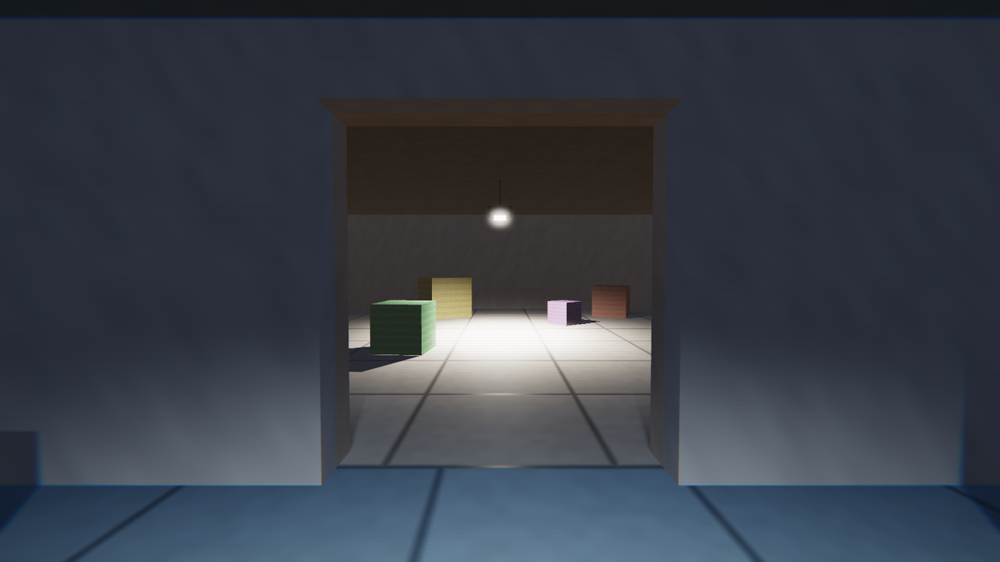 | 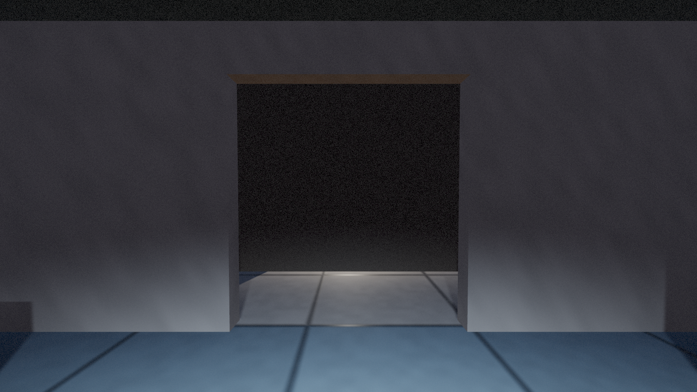 |

The door map is a plan of the hall on purpose: a doorway has twelve stations,
three to a side, and the border of a 5x5 board is a ring of exactly twelve cells.
An interface shaped unlike what it edits offers moves its subject cannot make.

Both maps are the same construction. The difference is the `subject` - where an
interface is *mounted* and what it *acts on* are separate questions:

```cpp
graph.embed("crate_map", "hall", "crate_map", "cratemap",   // mounted in the hall, edits the hall
            "crates_to_map", "map_to_crates", sg::EmbedSync::Live);
graph.embed("door_map", "annex", "door_map", "doormap",     // mounted in the annex, edits the hall
            "door_to_map", "map_to_door", sg::EmbedSync::Live, /*subject=*/"hall");
```

## Time

`sg::Temporal` holds timelines: elements with `time` and `frame`, moved by an
`advance` arrow. A drive gives each state its own timeline and fires its
behaviour arrows:

```cpp
auto& clock = graph.add<sg::Temporal>("clock");
pond.loop("spread", "ripple", "tick", [](sg::State&, sg::Element& e, sg::Element*, const sg::Event& ev) {
    e.params.set("r", e.params.num("r") + 2.0 * ev.args.num("dt"));
});
sg::drive(graph, clock, "pond", "tick", /*additive=*/true);   // the drive "clock>pond"
```

When the pond steps, its timeline advances by `dt` and its `tick` arrows receive
`{dt, time, frame}`. Paused states lose no time and resume without a jump.
One clock holds a timeline per state; `validate` rejects a line shared by two.
The current state steps first, then open guests in embedding order.

Time is a monoid of durations and a drive its action: `step(0)` is identity.
An `additive` drive also claims `step(a); step(b) == step(a + b)`: an exact flow
can keep this, Euler integration or compounding cannot. Additive drives omit
`frame`, since counting steps would break the claim:

```
drive @ drive clock>pond: pond.money.v was 100; pond [!tick(dt=0.5)@clock ; !tick(dt=0.5)@clock] leaves 225, pond [!tick(dt=1)@clock] leaves 200
```

A drive chooses when its timeline advances:

| `Keeps` | When |
| --- | --- |
| `WhileActive` (default) | Current state or a guest open in an active host |
| `WhileShown` | While any embedding shows it open, including elsewhere: a game on a set |
| `WhileFocused` | While it receives input: a game behind another window waits |
| `WhileEntered` | Only while it is current: a world in a painting waits on the wall |
| `Always` | Every frame: a record turning or door swinging in another room |

The engine steps each due state once per frame, including its open guests,
and carries Live results back to hosts. The game loop never steps it by hand.
Pictures (`own_time`) and sound use that same driven time.

`on_update` still runs. `engine.set_watch_hooks(true)` reports any state whose
hook - `on_update`, `on_event`, `on_render`, `on_enter`, `on_exit`, `on_pause`,
`on_resume` - writes its data instead of emitting an event for an arrow.

## Gluing

Rooms glued by doorways are one case of local pieces glued into a whole.
`sg/core/Sheaf.hpp` holds the general version and knows nothing about rooms:

* a **`Cover`** is a set of states with declared overlaps, each carrying its
  transition as a pair of functors;
* **descent** lets them glue: across an overlap and back is the identity
  (*separatedness*), and around every loop the composite is the identity
  (*cocycle*). A loop that does not close is a seam;
* **`sections(root)`** is the glued result, every piece joined to the root in
  one chosen chart, however far. It asks descent first: a cover with a seam
  glues to nothing (pass a `std::vector<std::string>*` to hear why). Descent
  is checked on every loop, not up to a length: a tree over the cover leaves
  one closing overlap per independent loop, and those are checked.

```cpp
for (const auto& seam : sg::descent_defects(atlas, graph)) std::cout << "seam: " << seam << "\n";
```

A doorway's transition is *derived* from its two portal elements each time it is
asked for, so it cannot drift from the geometry it describes.

Glued rooms are **adjacent, never overlapping**. A doorway's plane is where one
room ends and the next begins: each room's solids stay on its own side, and the
renderer draws each room only on its own side. A wall centred on the plane
would put half of itself in the neighbour, and each room's look would bleed
into the other's wall. `descent_defects` names it:

```
seam: hall.e_a reaches 0.150000 m past doorway doorway, into the room on the other side
```

Every image here is reproducible:
`./build/sg_room3d 50 out.ppm <room|approach|open|before|after|dim|doorway|annex|east|south|north|alert|crossing>`.
Shots advance fades by a fixed 1/60 s per frame, so a mid-fade frame is the same
on every run (`crossing` steps through the doorway at frame 30).

## The laws

An invalid structure is refused at the earliest point that can see it:

1. **Compile time** (`sg/core/Typed.hpp`). State and element names become C++
   tags, so composing arrows or functors whose ends do not meet, a lens whose
   halves do not mirror, or claiming non-parallel arrows equal does not build:
   ```
   error: static assertion failed: sg: g * f needs cod(f) == dom(g); these arrows do not meet
   ```
2. **Structure** (`graph.validate()`). Dangling arrows, unknown endpoints,
   unreachable states, functors whose image arrows do not line up, portals wired
   to the wrong state.
3. **Live data** (`sg/core/Laws.hpp`). `sg::verify(graph)` runs every law the
   graph owns (identity, associativity, composition, functoriality, the lens
   laws, seams, and any diagrams you pass) on the states' current contents,
   then puts everything back. Descent on a `Cover`, an `Adjunction`'s unit and
   counit, and `interface_defects` are checked apart, where they are declared.
   A broken law is a counterexample:
   ```
   functoriality @ functor post on restock: ledger.book.stock was <unset>;
       shop.shelf [restock ; post] leaves 42, shop.shelf [post ; order_wrong] leaves 40
   ```

Every data law says *these two paths, run on the same data, leave the same
result*:

| Law | The two paths |
| --- | --- |
| Identity | `id ; f` and `f ; id` against `f`, for arrows and functors |
| Associativity | `(f ; g) ; h` against `f ; (g ; h)` |
| Composition | a registered composite against the chain it was built from |
| Functoriality | `f` then `F` against `F` then `F(f)` - the functor carries the arrow's *action* |
| Put-get | write a view back, read it again: you see what you wrote |
| Put-put | writing the same view twice is writing it once |
| Settles | `(get ; put)` twice against once - a lossy view must still settle |
| Commutes | any two paths you declare equal |
| Descent | separatedness and cocycle on a `Cover` (`descent_defects`; not part of `verify`) |

"The same result" means every element's parameters and whether it is alive,
and every queued event - name, sender and arguments, in the order queued (the
queue is dispatched in that order). Two paths that queue `damage(5)` and
`damage(500)` do not agree, nor do `a, b` and `b, a`.

A report keeps apart what it found, what it could not check and where it
stopped looking: `ok()` is no structure problem or counterexample; `holds()`
also requires no unchecked equation; `complete()` is no search cut short by a
`LawOptions` budget (`bounded` empty). `sg::enforce` throws unless `holds()`.

Functoriality here is the square `f ; F == F ; F(f)` for each arrow `F` maps:
what the functor does to data agrees with what the arrows do. It is not by
itself the textbook `F(id) = id`, `F(g . f) = F(g) . F(f)`; identities hold by
construction, and a composite is held to the square only where `F` maps it.

```cpp
sg::Diagram d("shelf work");
d.commutes(sg::Path("shop", "shelf").arrow("restock").arrow("halve"),
           sg::Path("shop", "shelf").arrow("halve").arrow("restock"));
sg::verify(graph, {d});   // shop.shelf.stock was 30; [restock ; halve] leaves 21, [halve ; restock] leaves 27

// typed, the same claim cannot be written with arrows that do not share both ends
sg::typed::commutes(d, refund * sell, sg::typed::id<Shelf>());   // Shelf -> Shelf, both sides
sg::typed::commutes(d, sell, refund);                            // does not compile
```

`sg::enforce(graph)` throws a `LawError` instead of reporting. Arrows that read
event arguments are probed through `LawOptions` - an integrator that does nothing
at `dt = 0` passes every law vacuously, so give it a `dt`. Only elements, state
parameters and queued events are undone after a check; side effects a handler
has elsewhere are not.

The laws caught bugs earlier checks missed: identity functors dropping newly
created objects, mistyped composites ending in loops, stale composites after
rebuilds, and a demo "isomorphism" that held only on scratch data.

### The laws, compiled

Running every equation is slow on a big graph. Some can be answered without
running anything: every step on them says what it does. An arrow made with
`State::affine`, or a transport from `sg::transport::only` / `swizzle` /
`copy_all` / `affine`, carries its description (`sg/core/Declared.hpp`: each
parameter it sets is a sum of parameters it reads, times numbers - perhaps
times an event argument such as `dt` - plus a number). Its handler is made
from that description, so the two are one thing, not two truths. The
integrator of every `Spatial` body is such an arrow.

```
Equation {lhs, rhs} --try_compile--> representable? --yes--> algebra::Program --> a backend's batch --> the report
                                                    --no---> the verifier runs it, as before  ------------^
```

`sg::algebra` (`Operator.hpp`, `Program.hpp`, `Backend.hpp`, `Compile.hpp`)
compiles an equation into two programs over the live data. Two sides that
leave a parameter the very same expression hold it the same, and are not run
at all. What is left runs in a batch on a backend: the CPU (`CpuBackend`), or a
GPU (`sg/gpu/AlgebraBackend.hpp`: CUDA, ROCm, Vulkan, Metal, each built in where
its toolchain is found). An equation the batch finds apart, or too near the
tolerance to say, is run again by the verifier, and the verifier's
counterexample is what is reported. The laws stay the truth, and a step that
says nothing is run as ever.

```cpp
auto backend = sg::gpu::best();                 // a GPU if there is one here, the CPU if not
sg::algebra::Accelerated fast(*backend);        // compiled programs are kept, per graph
sg::LawOptions o;
o.accelerate = &fast;
sg::LawReport r = sg::verify(graph, {}, o);     // the same report, faster
```

`./build/laws/sg_algebra` holds every backend to the verifier's report, lawful and
broken. At 400 bodies: plain 0.9 s, compiled 0.3 s the first time and 35 ms
after.

## Using stategine in a project

Pin a release tag or commit; examples, tests and GLFW downloads default off
when included in a project. This example pins the implementation described here:

```cmake
include(FetchContent)
FetchContent_Declare(stategine
  GIT_REPOSITORY https://github.com/Bardia323/stategine.git
  GIT_TAG        5bf45e6cc5e6a2f7b678343a7d0a18e58e21fe15)
FetchContent_MakeAvailable(stategine)

target_link_libraries(my_game PRIVATE stategine::stategine
                      stategine::warnings          # optional: -Wall -Wextra / /W4
                      stategine::static_runtime)   # optional: self-contained MinGW exes
```

To change the engine and a project together, build against a local checkout,
uncommitted edits included: `-DFETCHCONTENT_SOURCE_DIR_STATEGINE=../stategine`.
[stategine-template](https://github.com/Bardia323/stategine-template) (private)
sets this up, with a ctest that runs every law on the game's world. What each
release breaks is in `CHANGELOG.md`.

## Writing a world

The examples below show the C++ API and what DSL declarations lower to.
Author new structure in the [notation](#the-notation) wherever it can express
it; keep C++ for runtime implementation, devices and native computations.

| Concept | In the engine | Category theory |
| --- | --- | --- |
| Element | `Element` in a state | object |
| Event morphism | `state.arrow(name, from, to, trigger, fn)` | arrow |
| Composite | `state.compose("gf", "f", "g", trigger)` | `g . f`, needs `cod(f) == dom(g)` |
| State | a `State` subclass | a small category |
| Transition | `graph.connect(from, trigger, to)` | arrow in the state graph |
| Data transport | `Functor` on a transition or portal | functor `A -> B`, partial: defined on the objects and arrows it maps |
| View + edit pair | `graph.add_lens(...)` | a functor pair |
| Adjoint pair | `Adjunction` | `F -| G` by unit, counit and triangle laws; isomorphism when both are identities |
| Extension along a functor | `sg::kan::left`, `sg::kan::right` | `Lan_K F`, `Ran_K F`: pointwise (co)limits searched among what `C` already has, compiled to an ordinary `Functor` |
| Nested interface | `graph.embed(...)` | a state inside an object of another |
| Cover, gluing | `Cover`, `Atlas`, `sections(root)` | descent |

### A state

```cpp
class Battle : public sg::State {
public:
    Battle() : sg::State("battle") {
        add_element("hero", "unit").params.set("hp", int64_t{20});
        add_element("slime", "unit").params.set("hp", int64_t{8});

        arrow("strike", "hero", "slime", "attack",          // hero --attack--> slime
              [](sg::State& s, sg::Element&, sg::Element* slime, const sg::Event& ev) {
                  const int64_t hp = slime->params.get_or<int64_t>("hp", 0) -
                                     ev.args.get_or<int64_t>("dmg", 1);
                  slime->params.set("hp", hp);
                  if (hp <= 0) s.emit("victory");   // said outward: the graph takes it from here
              });
        says("victory");   // declared: what the battle tells the world
    }
};
```

### A graph

```cpp
sg::StateGraph graph;
auto& battle = graph.add<Battle>();
graph.add<sg::ConsoleState>("menu");
graph.connect("battle", "victory", "menu");   // switch
graph.push("battle", "pause", "menu");        // stack on top
graph.pop("menu", "back");                    // and back off
graph.set_initial("battle");

sg::Engine engine(graph);
engine.start();
engine.fire(sg::Event{"attack", sg::Params{}.set("dmg", int64_t{8})});
engine.run(60.0);
```

A state's events stay local except those it `says`. The engine routes these
through transitions, declared functor event maps and edits. A state sees its
engine const and cannot move the stack itself; no listener or `engine.fire`
inside an arrow orchestrates the change. A law's trial keeps emitted events
local to the trial.
**Subscribers may observe the world; only the world may change it.** A
listener (`bus().subscribe`) reads the event and does what is outside the
world - draws, prints, plays a sound, logs. While it runs, firing the engine,
moving the stack or an embedding, sending a state an event and rewriting the
graph are refused with `sg::ObserverError` (`sg::set_observers(Observers::Report)`
says each once and lets it through, for a project moving its listeners into the
graph). No listener runs during a law's trial. An observer that must change the
world is part of it: a state, whose causes are arrows, functors, transitions.

What a state says may also be an **edit**: a request that rewrites the graph -
a room added, a doorway glued. The graph declares it, and the engine applies it
at the start of the next frame, before anything else moves; the answer comes
back to the state as `<event>.done`, for its own arrows to show:

```cpp
editor.says("cmd");
editor.says("enter");
graph.edit("editor", "cmd", [&](sg::StateGraph& g, const sg::Event& asked) {
    auto& made = g.add<sg::State>(sg::Key{asked.args.get_or<std::string>("name", "")});
    g.connect("editor", "enter", made.id());  // the new state is reachable
    return sg::Params{}.set("text", std::string("made"));
});
```

A functor maps events as well as objects and arrows, so what a state says also
crosses each functor out of it that names the event (`Functor::on_event`), to
the state it goes to, whose arrows run on it at once - relabelled, as a
transition's functor carries its event. An embedding's functors carry only
while it is open (its `in` from the host too); a transition's only when taken:

```cpp
graph.add_functor("desk.to.board", "desk", "board").on_event("chalk", "write");
graph.embed("board", "desk", "board_portal", "board", "desk.to.board", {}, sg::EmbedSync::Commit);
desk.says("chalk");   // an arrow of the desk emits chalk; the board's arrows on write run
```

Transitions take an optional `guard`, constant `enter` params, an `action`
and a carrying `functor`; entry params/actions supply `on_enter` arguments.
`"*"` as the source matches any state. A
transition's name is its identity: a name given twice is refused, and a made-up
one (`from-trigger->to`) gets `#2`, `#3` for alternatives on the same event; an
arrow's name is unique in its state. In a law, `Path::transition(name)` is the
transition the engine would take - on its trigger, only if the engine would
choose it there (guard and precedence), running its action, carrying the event,
entering where it goes; a pop returns to where the path last pushed from.

### Functors

Transports talk about parameter names, not 2D or 3D, so "the map's y is the
world's z" is one call. Built in: `copy_all`, `only({...})`,
`swizzle({{dst, src}, ...})`, `swizzle_scaled(pairs, fn)`, `then(a, b)`.

```cpp
sg::Functor& lift = graph.add_functor("lift", "world2d", "world3d");
lift.on_object("player", "player", sg::transport::copy_all)
    .on_morphism("move.player", "move.player")
    .on_event(flat.step_event(), deep.step_event());
graph.connect("world2d", "toggle", "world3d", "lift");   // a switch that carries by lift
graph.compose_functors("roundtrip", {"lift", "flatten"});   // g * f, checked at the seam
```

`Adjunction` is `F -| G`: declare a unit arrow
`a -> G(F(a))` and a counit arrow `F(G(b)) -> b` per object (`unit`,
`counit`, with `identity` marking no-op loops that stand for identities), and
`check` verifies both naturality squares and both triangle identities, on the
arrows. `laws::adjunction(graph, adj)` runs the same equations on live data.
The round trip need not come home - the order `0 < 1` collapsed onto a point
is adjoint to picking out `1`, with unit `0 -> 1` - so an adjunction is not an
isomorphism. What a round trip loses is still reported (`unit_defects`,
`counit_defects`, `data_defects`, `is_isomorphism`): those measure whether the
pair is an isomorphism, not whether it is adjoint.

A **Kan extension** derives an ordinary functor. Given `K : A -> B` and
`F : A -> C`, `sg::kan` finds what `F` must do on the part of `B` forced by `K`:

```cpp
sg::kan::Result r = sg::kan::left(graph, "K", "F", "extended");   // or kan::right
if (r.ok()) graph.add_functor(std::move(*r.functor));             // nothing can tell where it came from
else std::puts(r.str().c_str());                                  // defects, holes
```

At `b`, it searches existing `C` elements/arrows for
`Lan_K F(b) = colim(K | b)` over `K(a) -> b` (or `Ran_K F(b) = lim(b | K)`
over `b -> K(a)`): an apex every
other (co)cone factors through uniquely. It invents no object, arrow or code.
The result distinguishes:

- **it exists**: `functor`, an ordinary `Functor`;
- **it cannot exist**: `defects` - `C` has no (co)limit at some `b`, and the
  search there looked at everything; or `K` or `F` is not a functor;
- **not derivable (yet)**: `holes`, each a `Hole` with its `kind` and where
  it is - `Arrow` (the universal property sends an arrow to one `C` does not
  name: a composite or an identity loop to add), `Transport` (a transport
  not provably invertible, or one reading what `K` drops), `Budget` (a
  search stopped at `Options::max_path` / `max_cones`), `Unsupported` (what
  cannot be made executable: an opaque transport, `K` not an inclusion).

It keeps to: a functor only with `complete` and no hole or defect; a defect
only with `complete`; with `complete == false`, neither existence nor
nonexistence. `complete` is about search alone - an `Unsupported` hole may
stand with it true.

Transport is derived as `F . K^-1` from declared stages. At `b = K(a)`, the
identity leg permits undoing `K` only where its stages prove invertibility:
a whole copy or one-to-one rename carrying everything `F` reads. Collisions,
dropped inputs, arithmetic and copy-plus-renames leave `Transport` holes.
Identity `F` gives identity transport only when `K` carries the whole object.
Alternatively supply transport with `kan::Options::supply(b, transport)`.
Never guess code or copy everything as a fallback; an edit can add missing
structure, then compilation can retry.

A state is read as the category its arrows generate: a composite is the word
of its parts, a loop that does nothing is an identity. For now `K` is an
inclusion, and the extension covers what `K`'s image reaches (for `right`,
what reaches it). Hom-sets and cones are searched within `Options` budgets,
and a search cut short says so (`Hole::Budget`, `complete`).

`r.current(graph)` checks the three states' structure and two functors' maps.
Data changes alone leave the result current; recompile only after structure
changes.

### Embeddings

A transition replaces the active state; an embedding nests one inside an element
(the portal) of a running host.

* `EmbedSync::Live` - `out` runs every frame: the map moves the crate at once.
* `EmbedSync::Commit` - `out` runs on close; `close_embed(name, false)` cancels.
* `EmbedSync::View` - `in` runs during frames, with no automatic frame-time return.

An explicitly committed close applies a declared `out`; closing with
`close_embed(name, false)` cancels. With `set_follows(name, true)`, host arrows
own the portal's `open`: the engine follows it, including a noncommitting
close. Guest return events map through a functor to the host's close arrow.

"Every frame" is as the embedding's `Propagation` says (`graph.set_propagation`):

* `OnChange` (the default) - only the objects whose source or target changed
  since the direction last ran, found by their stamps; with nothing changed it
  costs a comparison. The same result as running every frame, for a transport
  that is a function of the two elements' params.
* `Continuous` - every object, every frame: for a transport that reads anything
  else (the time, another element).
* `OnEvent` - only in a frame in which an event crossed into the guest through it.
* `Manual` - only when `engine.sync_embed(name)` says so.

`set_focus(name, on)` says whether the embedding takes input when opened.
Configuration changes use counted graph setters (see *Who may change what*).

Open and close with `engine.open_embed(name)` / `close_embed(name)`, or fire
`embed.open` / `embed.close` with a `name`. A focused portal receives the
engine's events; portals nest.

## Models and architecture

A thing's shape is a recipe kept as text, one operation a line, and its mesh
is a function of the recipe alone (`sg::Modeler`, `sg/domains/Modeler.hpp`;
the language is [modeler.md](docs/modeler.md)). Shapes, cuts, sweeps, lofts,
lathes and imported `.obj` files (with their pictures) are combined, arrayed
and named as macros; a union keeps its exact faces, and only what a cut
touches is meshed from a field.

Architecture is written in the same language, from the rules buildings are
made by, not from facades. Each library is a set of words a recipe takes in
with `use <name>`:

| `use` | what it carries |
| --- | --- |
| `mould` | mouldings struck with compasses and swept: ovolo, cyma, cornices with dentils and modillions, balustrades, rustication, keystones, finials |
| `orders` | the five orders by Vignola's modules: columns with entasis, flutes and capitals, entablatures, pediments, porticos, arcades, colonnades |
| `pointed` | two-centred arches by their centre ratio, Tudor and ogee arches, rib vaults whose crowns meet, tracery, buttresses, flyers, pinnacles, roses |
| `girih` | Islamic star patterns, star-and-cross, strapwork, muqarnas, horseshoe and multifoil arches, domes, iwans, screens |
| `structure` | how a building stands: footings, walls, voussoir arches, barrel and groin vaults, domes on pendentives, trusses, stairs; and the frame building - grid, floors, core, curtain wall, storefronts, balconies |
| `city` | skyscrapers, blocks, houses, rowhouses, warehouses, shops, and lots, blocks and districts laid out by zone and seed |
| `param` | a style as a point in continuous axes (ornament, mass, verticality, pitch, glazing, tracery, dome, pattern, order...); presets mix (`let pa gothic`, `let pb islamic`, `let pt 0.4`) and any axis is set after |
| `arch` | whole buildings and their styles: `building`, `interior`, `tower`, `cathedral`, `mosque`, `palace`, `castle`; facades ask for their openings, so a room behind can open its wall there |

```
use pointed
pointed.vault 8 8 12          # a quadripartite rib vault, 8 m square, crown at 12 m
use city
city.district 3 3 zone=0 seed=7
```

`detail` sets how fine ornament is everywhere (0.5 for a palace's budget);
`default name value` gives a parameter a value unless it was said. Draw what
a recipe makes with `sgmodel <recipe> -s 1000` (four views, its faces and
open edges); `sgmodel --obj` exports it. The implementation is in
`src/domains/modeler/`.

## Land

Two projects built on the engine are joined by bringing one's states into
the other's graph - see [joining-projects.md](docs/joining-projects.md)
before doing it.

A land is made from a recipe too ([terrain.md](docs/terrain.md),
`sg/domains/Terrain.hpp`): any size at any fineness, noise, hills, ridges,
terraces, rain's erosion; roads graded along curves, paths, rivers cut
downhill, lakes filled to where they would spill, the sea, swamps; up to four
layers of covering (grass, earth, rock, sand, gravel, asphalt, snow) by
height, slope, wetness and nearness to road and water; and things strewn by
the same rules - any modeller recipe, the `trees` library's plants grown from
L-systems among them (`grow`, docs/modeler.md, *Growing*).

```
size 600 600 cell=1.5
noise 40 300 oct=5
ridge -30 160 0,-300 0,300
erode drops=150000
road 7 -40,-300 -10,-150 30,-40 0,80 -30,200 10,300 bank=6
layer grass grass
layer rock rock slope=30,90 noise=0.3
thing pine variants=4 : use trees / tree.pine h=12 seed=$v low=1
scatter pine density=0.3 road=6, slope=0,30 spacing=5 scale=0.8,1.3
```

`terrain::lay(world, name, land)` puts it in any 3D state: its ground is the
state's own (`Spatial3D::terrain`), which the walker stands on, rays stop at
and the renderer draws round the eye however far it goes. `sgterrain` draws a
land's map and says what it is; `sgland` draws it as a game would, sky, sun,
shadows and air (`--fog`).

## Rendering

Domain states never know about pixels, and renderers never know about a game:
anything speaking the shared vocabulary (`x/y/z`, `sx/sy/sz`, `r/g/b`,
`w/h/yaw`, in `sg::keys`) can be drawn. So one `Spatial3D` can be a lit room, a
terminal sketch and a texture on a wall at once.

`sg::render::GLWorldView` draws any `Spatial3D`: portal passes, lights and
PCF shadows (four own shadow casters plus doorway light), procedural materials,
fog, air lit by its lamps (optional) and optional ambient occlusion, then
bloom, a grade, tonemapping and FXAA (see [Air, grade and glow](#air-grade-and-glow)).
Walls are data - a state with `wall` elements gets them drawn, one without gets a
box. Knobs are in `sg::render::GLQuality`; elements set their own look through
parameters (`r/g/b`, `roughness`, `intensity`, ...).

`ViewPlan.cpp` derives cameras, clipping, room/portal geometry and draw candidates;
`Visibility` uses a separate BVH. `sg/gl/World.hpp` and `sg/web/WebGPU.hpp`
execute those derived answers. World bindings require an
open embedding or declared seam at that boundary; feeds require an open
embedding and `feed` portal. Bindings supply resources, never create access.
Raster panels may retain closed pictures and show outputs reached through
declared embeddings and functors.

The browser adds no world. The same source, `.sg` files, graph laws and
double-precision CPU networking build through Emscripten; native `sgc` remains
the host compiler. Shader time comes from declared state/Temporal data, never
a renderer wall clock. See [the browser build and interoperability guide](docs/browser.md).


A camera is a state of its own (`sg::Camera`): a lens, aimed by its arrows.
It sees a world when the graph says so - `sg::film(graph, camera, world, rig)`
embeds the world in its lens, the rig's pose carried onto it - and a screen
shows what it sees by naming that embedding (`shows`). Pointed at its own
screen, it shows the room, the screen in it, and so on down: each frame's
picture holds the frame before.

### Shots: many pictures from one start

A program that draws a world is slow to start and quick to draw. To look at a
change from several places, start it once and give it a shot script
(`sg::render::Shots`, `sg/gl/Shots.hpp`), one shot a line:

```
# '#' starts a comment
far:  go lounge; look -26 -2 33 1.65 49
crt:  look -95 -14 40.3 1.45 41.7      frames=90
```

Each shot's commands are the program's own - run through the `run` it gives,
so they change the world by the program's own ways - and it is held `frames`
frames (30 unless it says: fades, lit air and streaming settle), then its last
frame is read back and written as `<name>.png`; after the last, `sheet.png`
holds them all at half size. In the frame loop, `before(run)` before the tick
and `after(w, h)` before the swap; `done()` ends the run.

### Looks

How a room is shown is a state too. A `LookState` has one element per pass
(`shadow`, `scene`, `bright`, `blur`, `composite`); a parameter starting with `u`
is a uniform of that pass, and `fs`/`vs` replace its shaders. A look only states
how it differs from the standard one. Rooms *wear* looks through an embedding,
so looks are ordinary, reachable, validated states:

```cpp
auto& alert = graph.add<sg::LookState>("hall.alert");
alert.uniform(sg::passes::composite, "uTint", 1.3, 0.62, 0.55)
     .uniform(sg::passes::scene, "uFogDensity", 0.035)
     .fade(0.35);                                  // seconds to fade in
alert.shader(sg::passes::composite, my_composite); // a pass with its own shader

sg::wear(graph, "hall", "hall.calm");              // the first worn is active
sg::wear(graph, "hall", "hall.alert");
sg::set_look(hall, "hall.alert");                  // a parameter write; the renderer fades
```

Each room is drawn in its own look, so the annex keeps its fog when seen from
the hall. The post passes follow the room the viewer stands in.

What is on screen is a weighted blend of looks, changing over `fade` seconds.
A look with `fade = 0` cuts both in and out. If a fade is undone half way,
the blend walks back along the same
path to where it started. A third look reached mid-fade starts from the blend
on screen, not from either end. Numbers are weighted averages. The composite
pass runs every program in the blend and averages them, so a change of shader
dissolves too. The other passes use the shader of the heaviest look.

`view.prepare(graph)` compiles every look reachable in the graph before the
first frame. Looks that only change numbers share the built-in programs. It
also reports, as counterexamples, shaders that do not build (the built-in is
used instead), shaders missing a uniform the renderer sets, and looks that set
a uniform their shader does not have. `view.stats().late` counts anything
compiled mid-game because `prepare` never saw it.

| Calm | Alert (`L`) |
| --- | --- |
|  | 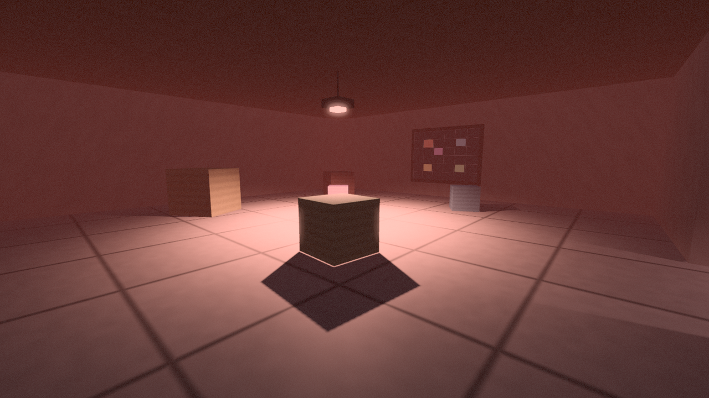 |

### Air, grade and glow

All of these are a look's, and fade with it; a look that says none of them
draws exactly as before and pays nothing for them.

**Lit air** (scene pass settings). Air that scatters the light passing
through it: a lamp's cone glows, a sun falls in shafts, and what stands in
the light throws its shadow through the glow.

| Setting | Means | Unless it says |
| --- | --- | --- |
| `scatter` | how much of the light through it a metre of air scatters towards the eye | 0: none, and nothing is gathered |
| `scatter.ahead` | how much of that goes on ahead rather than back, -1..1 | 0.5 |
| `scatter.far` | how far out from the eye it is gathered, in metres | across a room with walls, its box's diagonal (a little more); else the state's `far`, up to 90 |
| `scatter.cell` | pixels of the view to a cell, each way (2..64): finer air costs more | 16; fewer in a small view (about 120 cells across) |
| `scatter.steps` | points of each cell lit, spread through its depth (1..16): a beam thinner than a slice is caught, not dotted | 1 |

A light scatters its own `scatter` times the look's (1 unless it says): a
lamp that glows in the air more, or less, than it lights. Light that stands
in for bounce (`indirect`) lights no air. The air is gathered over cells of
the view (16 pixels each way), in 64 slices out from the eye that widen as
they go - each cell lit once, at a point of it a noise picks, so a shaft
crossing slices is a grain, never bands - by every light of the view through its cone and doorway and
shadowed by its own map, dimmed by the look's fog (`uFogDensity`,
`uFogStart`); the scene reads it at each pixel's distance (`air_light`), and
a doorway's view has only the air beyond the doorway - this side of it is
this side's. It is gathered for the eye's view and the views one doorway on,
and again only when the view, its lights or their shadow maps move
(`FrameTimes::air_built`). Every cell of every slice is lit in one pass,
and the slices are added up in eight: a gathering costs about a tenth of a
millisecond at 2560 x 1440 - in the lab's dev room, within what one run
differs from the next.

**Grade and curve** (composite uniforms, in every composite that pastes
`gl::film_glsl()`: its `tonemap` grades first). In scene light, before any
curve, so a world's feed on a screen is graded as the world is.

| Uniform | Means | Unset (0) |
| --- | --- | --- |
| `uGradeExposure` | stops up or down | as it is |
| `uGradeContrast` | about mid grey, in stops: 0.2 a fifth more | as it is |
| `uGradeSaturation` | 0.3 a third more, -1 grey | as it is |
| `uGradeShadows` | a colour lifted into the darks (vector) | none |
| `uGradeHighlights` | the lights times 1 + it (vector) | none |
| `uTonemap` | 1: a curve through mid grey whose channels each go to white on their own near the top (crosstalk) | the ACES blend |

What a grade pushes out of the widest gamut (BT.2020) is brought back to its
edge. (A feed shown as paint, `untone` 1, is taken back through the ACES
blend: a world on a wall should keep that curve.)

**Glow in thick air** (composite uniforms, in the standard composite and any
that pastes `gl::fog_bloom_glsl()`): `uFogBloom`, how much more of the bloom
is added for each unit of optical depth between the eye and what a pixel
shows - a lamp deep in fog is haloed more than one near - and `uFogBloomCap`,
the optical depth past which it spreads no more (3 unless it says). The
renderer hands it the view's depth only while a look asks for it.

## The notation

What this page has written in C++ - a state and its arrows, a functor, an
embedding, a transition, a seam, a drive - has a textual form, and the form is
only that: another syntax for the same model. A program is a *presentation* of
a graph; `sgc` reads it, holds it to the ontology, and writes the C++ that
builds the same construction through the engine's own API. There is no
interpreter, no script and no second runtime; the engine that runs the result
does not know where its declarations came from.

The excerpt below comes from the complete [vertical slice](tests/dsl/scenario.sg).
That source supplies the `room` and its gate, camera and native bindings.

```
state time : temporal
initial void

state void : spatial3d {
    element terminal : portal { x = 0.0  y = 1.0  z = -2.0  w = 1.6  h = 1.0  open = true }
    element gate     : portal { x = 3.0  yaw = 1.5707963267948966  w = 1.0  h = 2.0 }
}
state terminal { element screen : portal { w = 1.6  h = 1.0  open = true } }

state exit {
    element idle
    element playing
    element finished
    element runner : sprite { x = 0.0  vx = 2.0 }

    idle -> playing : start on exit.start
    playing -> finished : win on exit.win native exit_won      # the inside of the arrow is C++
    runner -> runner : run(dt) on exit.tick { x = x + vx * dt } # or it says what it does (an Affine)

    say exit.out
}

embed void.terminal -> terminal  sync commit  focus true  follows true
embed terminal.screen -> exit    sync commit  focus true  follows true
drive time -> exit.tick keeps focused

seam void.gate <-> room.gate  name gate        # a shared boundary ...
transition void -[exit.out]-> room carry gate.ab   # ... and one way through it

state void.look : look { fade = 0.4  element scene : pass { uAmbient = 0.2  uSky = [0.05, 0.06, 0.08] } }
wear void <- void.look
```

Every construct is one engine primitive: `state` a `State` (of the kind's own
class: `state`, `temporal`, `spatial2d`, `spatial3d`, `look`, `camera`,
`console`), `element` and `key = value` its data, `a -> b : name` an arrow
(`loop` when `a` is `b`), `compose` composition, `functor` with `object` and
`event` maps, `compose f = g ; h` and `lens` for functors, `transition`,
`embed`, `seam` (`sg::glue_doorway`), `drive`, `port`, `keep`, `edit`,
`initial`. Sugar is only sugar: `wear` is `sg::wear`, `film` is `sg::film`,
`when e1 e2` an event mapping of a functor, `bind` a table an input adapter
turns into `Engine::fire`. `extern state` names a state built in C++, so the
two can be ported one declaration at a time. A seam and a transition are
different claims - a shared boundary, a directed change of active state - and
neither makes the other.

What the ontology forbids has no syntax, and the compiler says why: a private
timer (`elapsed`), a write from one state into another, IO in a transport, a
callback, `on_update`. C++ supplies devices and named *native* computations
inside declared arrows, transports and edits (`sg::dsl::Natives`). Arrows get
their own state/elements, transports their declared endpoints; edits get the
graph as their rewrite capability. These are trusted extensions with restricted
interfaces, not a sandbox.

```cmake
stategine_compile_dsl(game NAME world SOURCES src/world.sg)   # -> sgen::build_world(graph, natives, bindings)
```

`stategine_compile_dsl` generates `<build>/dsl/<name>.cpp` and links
`stategine::dsl`. Call the generated builder after its external states exist.
`SG_BUILD_DSL` controls compiler/library construction and defaults on.

The same plan can be made on a running graph: a source held by an ordinary
state, a compiler that is a state with native arrows, and the change asked of
the graph by `graph.edit` - the world rewriting itself by the one lawful way
(`sg/dsl/Compiler.hpp`, `src/dsl/compiler.sg`). `sg::dsl::facts(graph)` says
what a graph is made of in canonical lines, so what a DSL program declares can
be held beside the C++ it replaces before that C++ goes.

Live `dsl::apply` is atomic: failure rolls back graph and touched data.
Facts preserve entry values, transports, relation order and named native
bindings. See [notation.md](docs/notation.md) for the syntax and migration checks.

## A game's modules

A state or related group forms a module/library. Headers declare; `.cpp` files
implement and compile independently. The linker joins them; a changed body
recompiles only its own file.

```cmake
FetchContent_MakeAvailable(stategine)
stategine_module(sheets)                          # src/sheets/*.cpp
stategine_module(desert USES sheets)              # may include sheets/ - nothing else of yours
stategine_module(room   USES sheets desert EXCLUDE main)
add_executable(game src/room/main.cpp)
target_link_libraries(game PRIVATE room)
stategine_check_modules()                         # one test: modules their own, headers in shape
```

`stategine_check_modules()` fails on a module that includes one it does not
`USES` (never what uses it), and on a body in a header that is longer than a
line and neither a template, constexpr, nor said why (`// inline: ...`).

## Performance

Names are interned once, so hot paths compare pointers; morphisms are bucketed
by trigger; `Params` is a flat vector; queues reuse their buffers; surfaces and
portal textures redraw only when something moved. An earlier `sg_bench` run
(512 bodies, -O2) illustrates the measurements; rerun on your current machine:

```
element lookup                      96,000 k/s
frames (512 integrator arrows)          40 k/s      ~20M arrow applications/s
functor apply (512 objects)         21,000 k/s
frames with a live portal               16 k/s      (9 k/s carrying everything every frame)
```

**Pay when the structure changes, not while it stands.** Everything the engine
works out and keeps is derived from the one graph, holds nothing of its own,
and is thrown away and found again when what it was found on changes:

* *Stamps.* Every change of an element's params gets the next number of one
  count (`Params::stamp()`; setting a value it already holds is no change). A
  stamp names content, so a copy - a snapshot, a restored default - carries it.
  `State::structure()` is stamped when elements or arrows come or go;
  `State::content_version()` folds a state's stamps into one number.
* *Portals.* An embedding's route (states, functors) is resolved once per
  change of the graph's `topology()`; its functor keeps a `Functor::Memo` of
  which element went where and what each held, and carries only what changed.
* *Validation.* `validate()` checks a state's arrows, a functor's endpoints and
  reachability again only when their structure moved; `validate(false)` checks
  everything, to compare.
* *Laws.* A `LawCache` keeps each equation's answer with the versions of what
  its paths read (`verify(graph, cache)`), reuses a side of an equation that is
  unchanged when the other is not, and checks directly an equation that is
  cheaper to run than to keep or never comes out the same twice. Without a
  cache, `verify` is still faster: a side's end state is taken, not copied,
  and sides that left the same stamps agree without a value compared.

`./build/sg_bench_scale` measures 1K..1M objects against the plain way
(`--quick`, `--big`, or case numbers). In the earlier run, a Live
portal of 100K objects costs 0.5 ms a frame idle and 1.6 ms with 1% changing,
against 72 ms carrying everything; with every object changing, still less
than half. A graph verified again unchanged costs about 45% of a fresh check.

## Who may change what

Whoever holds the `StateGraph` - the code that builds the world, and whatever
rewrites it as it runs - may change anything in it. Whoever holds it `const`
may look at everything and change nothing: a const graph gives const states,
elements, functors. The engine shows the world const (`current()`,
`focused()`, `graph()`): a caller acts on it by firing events. A state changes
its own data in its update and its arrows (handed the state); functors carry
data into the state they land in; an embedding acts on its declared subject.

What the graph is made of - states, their elements and arrows, functors and
their maps, embeddings, seams, transitions - is counted by `revision()` (the
interfaces alone by `topology()`), one add per change and nothing else;
changing a value never counts. Embeddings, transitions, seams and arrows are
declared and then read: nothing rewrites one in place behind the graph's back
(`set_sync`, `set_propagation`, `set_carry`, `drop_embedding`, `set_functor`
do it, counted). The engine checks the graph again at its next frame after the
count moved; unchanged, it is not checked.

An element's identity is fixed when it is made: `id` and `kind` read like any
`Key`, and nothing but the element sets them. A mutable state hands out its
elements (`elements()`, an `ElementRange`) to act on, never the list itself.

A law's trial runs arrows on the live graph, then puts their data back. It
does not try to put back structure: while a trial runs, nothing structural is
let happen at all - no functor, embedding or seam, and no element or arrow
added to or taken from any state. A path that would do it throws
`RewriteRefused` before anything changes, and its equation is reported as
unchecked (`LawReport::unchecked`), apart from the counterexamples.

## Layout

Public headers are under `include/sg/`; implementations mirror them under
`src/`. The layer dependencies below are checked by `sg_shape`.

```
include/sg/
  core/      the engine, domain-agnostic
    Core.hpp State.hpp Functor.hpp Adjunction.hpp Kan.hpp Embedding.hpp
    StateGraph.hpp Engine.hpp Sheaf.hpp (covers, descent) Temporal.hpp
    Relax.hpp (a relation's gap, the orbit of a step toward it, locality)
    Assets.hpp Store.hpp Text.hpp (owner folders, content, serialization)
    Laws.hpp (laws on live data)  Typed.hpp (compile-time typed handles)
    Declared.hpp (what a step does, said: affine arrows and transports)
  algebra/   the laws compiled: Operator, Program, Backend (CPU), Compile
  gpu/       the algebra's batches on a GPU: AlgebraBackend.hpp (src/gpu: CUDA, ROCm, Vulkan, Metal)
  domains/   state vocabulary: Spatial, Atlas, Console, Surface, Look, Camera,
    Light, Shapes, Modeler, Terrain (uses core; the modeller and its
    libraries are implemented in src/domains/modeler/, the terrain in
    src/domains/terrain/)
  spatial/   pure geometry: Math.hpp, Geometry.hpp, Index.hpp (no state ownership)
  physics/   solvers a state can step in its arrows, plain data in and out:
    Rigid.hpp (sg::rigid: bodies that fall, stack, tip, roll, sleep, are held)
    Rope.hpp  (sg::rope: cords that hang, lie over edges, never pass through)
    Field.hpp (sg::field: sources, channels, receivers, pure query solver)
  net/       Cellular.hpp, LinearSystem.hpp, Backend.hpp, Reconcile.hpp,
    Transport.hpp, Peer.hpp, Partition.hpp, Exchange.hpp, Distributed.hpp,
    Epoch.hpp, Integrity.hpp, Verify.hpp, Agreement.hpp, Protocol.hpp,
    Prediction.hpp, Placement.hpp, IceTransport.hpp (uses core;
    derived networking machinery, built as stategine::net)
  render/    Ascii, Visibility, ViewPlan, Geometry, Defaults
    (uses core, domains, spatial; no GPU or window dependency)
  gl/        native OpenGL executor (World.hpp; uses render)
  web/       browser WebGPU, WebRTC and DOM adapters (uses render/net/DSL)
  dsl/       parse, kinds, compile/lower, plan, emit, apply, facts, natives,
    compiler state (uses core, domains; built as stategine::dsl)
  sg.hpp     umbrella for core + domains (renderers are opt-in)
  Version.hpp
```

Rigid implementation is split into broadphase, collision, queries, ray queries,
joints and solving. Physics, fields and rendering each keep their own derived
spatial index. `sg.hpp` includes core/common domains; physics, net, render, DSL and
algebra headers are opt-in. `cmake/` holds module, DSL and GPU build helpers;
`examples/` and `tests/` demonstrate and check them.

A network remains an ordinary state. [networking.md](docs/networking.md)
describes vector stalks, sparse restrictions, CPU/CUDA backends, partitioned
diffusion, bounded asynchronous relaxation, pure execution placement and the
DSL examples. Singular problems retain their synchronous canonical component.
Disposable execution workspaces retain certificates and numerical capacity;
each peer computes its canonical reference once per validated immutable problem.
Compact signed control messages recover missing data explicitly. Opt-in
`SG_BUILD_NET_BENCH=ON` adds `sg_net_bench` for cold/warm CPU/CUDA, distributed,
verification and protocol measurements; see the networking guide for results.
`sg_net_peer` runs the same declared world on
equal peers over external UDP sockets; `sg_net_processes` checks four processes
against a single-machine result. Signed regional execution is demonstrated by
[verified.sg](examples/verified.sg): `sg_net_verified_processes` runs three
independent executors in a four-member committee, including mixed CPU/CUDA,
with one member absent. They verify the same inputs, solve independently and
deliver only matching quorum finalizations through the declared port.
Optional `SG_NET_ICE=ON` builds an external libdatachannel transport with encrypted
ICE/STUN/TURN sessions, bounded queues and separate control/boundary channels.
Transport routing is explicit; application payloads stay opaque. Placement and
application interest policies return plans; actual overlaps change through
`graph.edit` and migrations retain verified handoffs.
The optional ICE target currently rejects Windows MinGW GCC 16/UCRT because
its RTC teardown crashes; use Clang/libc++ for that target. CPU/CUDA and UDP
remain supported with the existing compiler. See the [networking limitations](docs/networking.md).

`sg_net_pong` is a standalone two-peer Pong world declared in
[pong.sg](examples/pong/pong.sg). On Windows, run
`powershell -ExecutionPolicy Bypass -File examples/pong/run.ps1` to open both
instances. W/S moves the left paddle and Up/Down the right while either window
has focus; Esc closes its window. The launcher chooses free localhost UDP
ports, generates fresh signing credentials and uses CUDA when available
(`-Backend cpu` selects CPU; `-DelayMs 60` demonstrates latency). Each peer
signs its paddle command and published boundary positions. Commands remain
discrete; continuous positions go through the sheaf solver. Both peers verify
the proposed result and deterministic next game checkpoint before finalizing.
A bounded forecast responds to local input, replays late inputs, and smooths
visual corrections using Temporal time; only finalized game data determines
scores. `--hosts host0,host1 --credentials folder` also supports reachable
IPv4 peers; see [networking.md](docs/networking.md) for key distribution.
The `sg_net_pong` CTest checks
real CPU/CUDA processes, delayed/duplicate packets, rallies, scoring, strict
graph validation and `sg::verify`.

Fields are computations inside an owning state: its arrows derive sources and
receivers from params and write responses. Ordinary gravity is
`World::fields = {field::Source::directional("gravity", vector)}`, replacing
`World::gravity`. Time-dependent fields use the drive interval's start in
`world.step(dt, time - dt)`. [fields-and-views.md](docs/fields-and-views.md)
covers channels, body-local emitters, support bounds and specialized backends;
[examples/fields.sg](examples/fields.sg) adds a host-controlled projector and
nested 3D embeddings without traversal.

## Build and run

Native programs are directly in `build/`; static libraries are in `build/lib/`. Checks are in
`build/laws/`, logs in `build/logs/`, and the browser build in `build/wasm/`.

```sh
cmake -S . -B build -G "MinGW Makefiles"   # or any generator; -DSG_BUILD_GL=OFF skips GLFW
cmake --build build -j
ctest --test-dir build                     # unit tests, laws, must-not-compile cases
./build/sg_room3d
```

| Target | What it is |
| --- | --- |
| `sg_room3d` | **the real one**: one lit OpenGL space, two rooms, two maps |
| `sg_room` | the same room and lens, in the terminal |
| `sg_demo` | console/2D/3D states, an isomorphic pair, transitions, a portal, the laws - headless |
| `sg_tests` | Core, functors, portals, rooms, looks, time, defaults and stores |
| `sg_laws` | every data law holding, then broken on purpose and read back |
| `sg_looks_gl` | looks on a real GL context: broken shaders named, fallbacks, late compiles counted (needs a display) |
| `compile_fail_*` | pass only if an ill-typed composition is refused with stategine's own message |
| `sg_core_only` | the core with no domain or renderer - the layering, as a build failure |
| `sg_bench` | hot-path throughput |
| `sg_bench_scale` | incremental law/portal costs at larger scales |
| `sg_spatial`, `sg_fields`, `sg_rigid`, `sg_rope` | spatial queries, field responses and solvers |
| `sg_projected`, `sg_projected_gl` | declared projected/nested views, including GL state/fact preservation |
| `sg_dsl`, `sg_dsl_strong`, `sgc` | notation, equivalence, atomic apply and faithful facts; compiler CLI |
| `sg_authority`, `sg_incremental`, `sg_algebra`, `sg_shape` | ownership, cached/uncached agreement, compiled laws and layers |
| `sg_doorway_light_gl`, `sg_instancing_gl` | light through seams and batched drawing |

`sg_room3d` controls: `WASD` walk (moves the token in map mode), mouse look,
`E` use a map, `Tab` next token, `C` cancel, `Q`/`R` slide the lamp, `F` dim,
`L` switch the hall's look, `Esc` release mouse / quit. `./build/sg_room3d 120 frame.ppm` renders 120 frames
to a PPM and exits.
